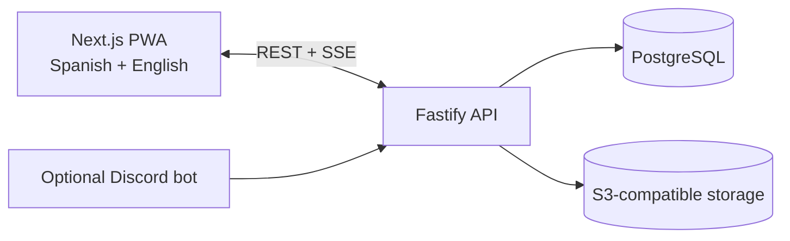

<p align="center">
  <picture>
    <source media="(prefers-color-scheme: dark)" srcset="apps/web/public/brand/opentournament-symbol-on-dark.png">
    <source media="(prefers-color-scheme: light)" srcset="apps/web/public/brand/opentournament-symbol-on-light.png">
    
  </picture>
</p>

<h1 align="center">OpenTournament</h1>

<p align="center">
  <strong>Run the whole tournament. Keep control of the platform.</strong><br>
  Open-source tournament operations for esports communities, venues, universities, streamers, and independent organizers.
</p>

<p align="center">
  <a href="https://github.com/Dieguezar/opentournament/actions/workflows/ci.yml"></a>
  <a href="https://github.com/Dieguezar/opentournament/releases/latest"></a>
  <a href="LICENSE"></a>
  <a href="docs/SELF_HOSTING.md"></a>
</p>

<p align="center">
  <a href="#quick-start">Quick start</a> ·
  <a href="docs/README.md">Documentation</a> ·
  <a href="CONTRIBUTING.md">Contribute</a> ·
  <a href="docs/ROADMAP.md">Roadmap</a> ·
  <a href="docs/BRAND_IDENTITY.md">Brand system</a>
</p>

<p align="center"><sub><strong>English</strong> · <a href="README.es.md">Español</a></sub></p>

<picture>
  <source media="(prefers-color-scheme: dark)" srcset=".github/assets/readme-tournament-dark.jpg">
  <source media="(prefers-color-scheme: light)" srcset=".github/assets/readme-tournament-light.jpg">
  
</picture>

## Tournament operations, not just a bracket generator

OpenTournament manages the full lifecycle in one self-hosted workspace: public rules, registration, teams, check-in, brackets, match coordination, reports, private evidence, disputes, arbitration, and final standings.

| Organize                                                | Compete                                                                 | Resolve                                                                  | Publish                                                                   |
| ------------------------------------------------------- | ----------------------------------------------------------------------- | ------------------------------------------------------------------------ | ------------------------------------------------------------------------- |
| Registration, waitlists, approvals, teams, and check-in | Single or double elimination, BO1/BO3/BO5, walkovers, and game adapters | Configurable reporting, private evidence, disputes, and recorded rulings | Public tournament pages, live SSE updates, standings, and installable PWA |

## Quick start

Get a complete demo running locally:

```bash
cp .env.example .env
# Set SEED_DEMO_DATA=true in .env
pnpm install
docker compose up -d postgres minio
pnpm dev
```

Open [http://localhost:3000](http://localhost:3000). The API applies migrations and creates the demo automatically when `SEED_DEMO_DATA=true`.

<details>
<summary><strong>Demo account and public tournaments</strong></summary>

- Email: `admin@opentournament.local`
- Password: `demo-password-123`
- Valorant: [Copa Nexo 2026](http://localhost:3000/t/copa-nexo-demo)
- League of Legends: [Liga Nexo LoL](http://localhost:3000/t/liga-nexo-lol)
- Super Smash Bros. Ultimate: [Smash Random Showdown](http://localhost:3000/t/smash-random-showdown)

The idempotent seed includes active and completed tournaments, registered teams, check-ins, match results, per-game details, and a resolved dispute. Run it again at any time with `pnpm db:seed`.
</details>

For production, follow the [self-hosting guide](docs/SELF_HOSTING.md). Docker requires a unique `SESSION_SECRET`, does not seed demo data by default, and waits for service health checks before starting dependents.

## What is included

- **Tournament engine:** single and double elimination for 8–128 participants, designed to scale beyond 512 without an architectural rewrite.
- **Competition formats:** BO1, BO3, and BO5 series, game-specific draws, configurable check-in windows, and automatic walkovers.
- **Identity and access:** public viewing without an account, revocable participant passes, and optional permanent accounts through email or Discord.
- **Game support:** generic, Valorant, CS2, League of Legends, and Super Smash Bros. Ultimate adapters. LoL and Smash include versioned competitive templates and guided reporting.
- **Operational trust:** bilateral, winner-only, or staff-only reporting; private-by-default evidence; referee disputes; audit trail.
- **Reach:** Spanish and English interfaces, live public pages through SSE, an installable PWA, and optional Discord integration.

## Architecture



| Layer     | Technology                            |
| --------- | ------------------------------------- |
| Frontend  | Next.js + TypeScript                  |
| Backend   | Fastify + TypeScript                  |
| Data      | PostgreSQL + Drizzle ORM              |
| Storage   | MinIO locally; R2/S3 in production    |
| Real-time | Server-Sent Events                    |
| Tooling   | pnpm + Turborepo, Vitest + Playwright |

## Project status

`v1.0.0` is released. The technical foundation, tournament management, results, arbitration, SSE/PWA, and open-source release workflow are operational. Discord remains optional and expansion work continues.

Track the [latest release](https://github.com/Dieguezar/opentournament/releases/latest), [roadmap](docs/ROADMAP.md), [release checklist](docs/RELEASE_CHECKLIST.md), and [decision log](docs/DECISIONS.md).

## Documentation and contributing

Contributor-facing documentation is canonical in English. Start with the [documentation index](docs/README.md), then use the path that matches your goal:

| I want to…                        | Start here                                                                                                   |
| --------------------------------- | ------------------------------------------------------------------------------------------------------------ |
| Understand the product            | [Product vision](docs/PRODUCT_VISION.md) and [MVP scope](docs/MVP_SCOPE.md)                                  |
| Understand the system             | [Architecture](docs/ARCHITECTURE.md), [data model](docs/DATA_MODEL.md), and [API design](docs/API_DESIGN.md) |
| Add a game                        | [Game adapter guide](docs/GAME_ADAPTERS.md)                                                                  |
| Run my own instance               | [Self-hosting guide](docs/SELF_HOSTING.md)                                                                   |
| Contribute code or documentation  | [Contributing guide](CONTRIBUTING.md)                                                                        |
| Use the visual identity correctly | [Brand identity](docs/BRAND_IDENTITY.md)                                                                     |

Please read the [Code of Conduct](CODE_OF_CONDUCT.md) and [Security Policy](SECURITY.md) before contributing or reporting a vulnerability.

## License

OpenTournament is released under the [MIT License](LICENSE).
