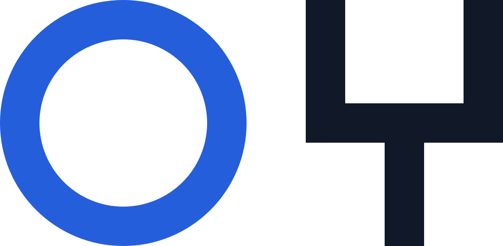
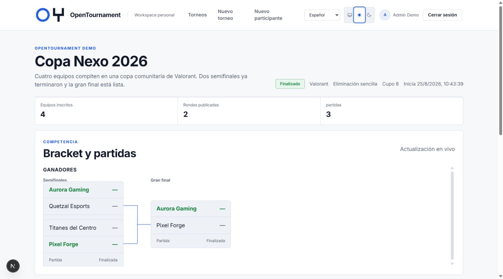
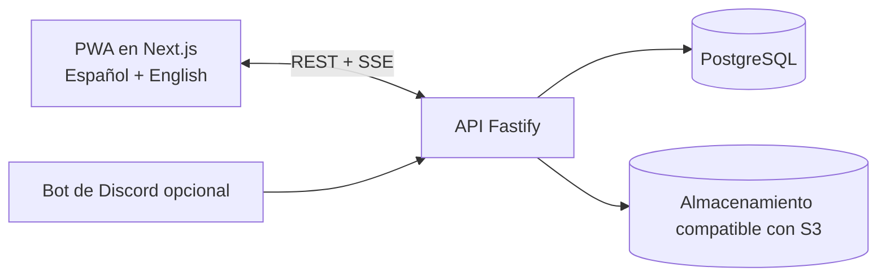

<p align="center">
  <picture>
    <source media="(prefers-color-scheme: dark)" srcset="apps/web/public/brand/opentournament-symbol-on-dark.png">
    <source media="(prefers-color-scheme: light)" srcset="apps/web/public/brand/opentournament-symbol-on-light.png">
    
  </picture>
</p>

<h1 align="center">OpenTournament</h1>

<p align="center">
  <strong>Gestioná todo el torneo. Conservá el control de la plataforma.</strong><br>
  Operación open source de torneos para comunidades de esports, locales, universidades, streamers y organizadores independientes.
</p>

<p align="center">
  <a href="https://github.com/Dieguezar/opentournament/actions/workflows/ci.yml"></a>
  <a href="https://github.com/Dieguezar/opentournament/releases/latest"></a>
  <a href="LICENSE"></a>
  <a href="docs/SELF_HOSTING.md"></a>
</p>

<p align="center">
  <a href="#inicio-rápido">Inicio rápido</a> ·
  <a href="docs/README.md">Documentación</a> ·
  <a href="CONTRIBUTING.md">Contribuir</a> ·
  <a href="docs/ROADMAP.md">Roadmap</a> ·
  <a href="docs/BRAND_IDENTITY.md">Sistema de marca</a>
</p>

<p align="center"><sub><a href="README.md">English</a> · <strong>Español</strong></sub></p>

<picture>
  <source media="(prefers-color-scheme: dark)" srcset=".github/assets/readme-tournament-dark.jpg">
  <source media="(prefers-color-scheme: light)" srcset=".github/assets/readme-tournament-light.jpg">
  
</picture>

## Operación de torneos, no sólo un generador de brackets

OpenTournament gestiona el ciclo completo en un único espacio autoalojable: reglas públicas, inscripciones, equipos, check-in, brackets, coordinación de partidas, reportes, evidencias privadas, disputas, arbitraje y clasificación final.

| Organizá                                                         | Competí                                                                      | Resolvé                                                                      | Publicá                                                                       |
| ---------------------------------------------------------------- | ---------------------------------------------------------------------------- | ---------------------------------------------------------------------------- | ----------------------------------------------------------------------------- |
| Inscripciones, lista de espera, aprobaciones, equipos y check-in | Eliminación sencilla o doble, BO1/BO3/BO5, walkovers y adaptadores por juego | Reportes configurables, evidencia privada, disputas y decisiones registradas | Páginas públicas, actualizaciones SSE en vivo, clasificación y PWA instalable |

## Inicio rápido

Levantá una demo completa en local:

```bash
cp .env.example .env
# Configurá SEED_DEMO_DATA=true en .env
pnpm install
docker compose up -d postgres minio
pnpm dev
```

Abrí [http://localhost:3000](http://localhost:3000). La API aplica las migraciones y crea la demo automáticamente cuando `SEED_DEMO_DATA=true`.

<details>
<summary><strong>Cuenta demo y torneos públicos</strong></summary>

- Correo: `admin@opentournament.local`
- Contraseña: `demo-password-123`
- Valorant: [Copa Nexo 2026](http://localhost:3000/t/copa-nexo-demo)
- League of Legends: [Liga Nexo LoL](http://localhost:3000/t/liga-nexo-lol)
- Super Smash Bros. Ultimate: [Smash Random Showdown](http://localhost:3000/t/smash-random-showdown)

La semilla idempotente incluye torneos activos y finalizados, equipos inscritos, check-ins, resultados, detalle por partida y una disputa resuelta. Podés ejecutarla nuevamente con `pnpm db:seed`.
</details>

Para producción, seguí la [guía de autoalojamiento](docs/SELF_HOSTING.md). Docker exige un `SESSION_SECRET` único, no carga datos demo por defecto y espera los chequeos de salud antes de iniciar cada servicio dependiente.

## Qué incluye

- **Motor de torneos:** eliminación sencilla y doble para 8–128 participantes, diseñado para escalar a más de 512 sin reescribir la arquitectura.
- **Formatos competitivos:** series BO1, BO3 y BO5, empates según el juego, ventanas de check-in configurables y walkovers automáticos.
- **Identidad y acceso:** lectura pública sin cuenta, pases revocables para participantes y cuentas permanentes opcionales con correo o Discord.
- **Juegos:** adaptadores genérico, Valorant, CS2, League of Legends y Super Smash Bros. Ultimate. LoL y Smash incluyen plantillas competitivas versionadas y reportes guiados.
- **Confianza operativa:** reporte bilateral, sólo por el ganador o exclusivo del staff; evidencia privada por defecto; disputas; auditoría.
- **Alcance:** interfaz en español e inglés, páginas públicas en vivo mediante SSE, PWA instalable e integración opcional con Discord.

## Arquitectura



| Capa           | Tecnología                            |
| -------------- | ------------------------------------- |
| Frontend       | Next.js + TypeScript                  |
| Backend        | Fastify + TypeScript                  |
| Datos          | PostgreSQL + Drizzle ORM              |
| Almacenamiento | MinIO en local; R2/S3 en producción   |
| Tiempo real    | Server-Sent Events                    |
| Herramientas   | pnpm + Turborepo, Vitest + Playwright |

## Estado del proyecto

`v1.0.0` está publicada. La base técnica, la gestión de torneos, resultados, arbitraje, SSE/PWA y el flujo de publicación open source están operativos. Discord permanece opcional y la expansión continúa.

Consultá la [última versión](https://github.com/Dieguezar/opentournament/releases/latest), el [roadmap](docs/ROADMAP.md), el [checklist de release](docs/RELEASE_CHECKLIST.md) y el [registro de decisiones](docs/DECISIONS.md).

## Documentación y contribuciones

La documentación canónica para contribuidores está en inglés. Empezá por el [índice de documentación](docs/README.md) y seguí la ruta que corresponda a tu objetivo:

| Quiero…                                | Empezá acá                                                                                                        |
| -------------------------------------- | ----------------------------------------------------------------------------------------------------------------- |
| Entender el producto                   | [Visión de producto](docs/PRODUCT_VISION.md) y [alcance del MVP](docs/MVP_SCOPE.md)                               |
| Entender el sistema                    | [Arquitectura](docs/ARCHITECTURE.md), [modelo de datos](docs/DATA_MODEL.md) y [diseño de API](docs/API_DESIGN.md) |
| Agregar un juego                       | [Guía de adaptadores](docs/GAME_ADAPTERS.md)                                                                      |
| Ejecutar mi propia instancia           | [Guía de autoalojamiento](docs/SELF_HOSTING.md)                                                                   |
| Contribuir código o documentación      | [Guía de contribución](CONTRIBUTING.md)                                                                           |
| Usar correctamente la identidad visual | [Identidad de marca](docs/BRAND_IDENTITY.md)                                                                      |

Leé el [Código de Conducta](CODE_OF_CONDUCT.md) y la [Política de Seguridad](SECURITY.md) antes de contribuir o reportar una vulnerabilidad.

## Licencia

OpenTournament se publica bajo la [Licencia MIT](LICENSE).
