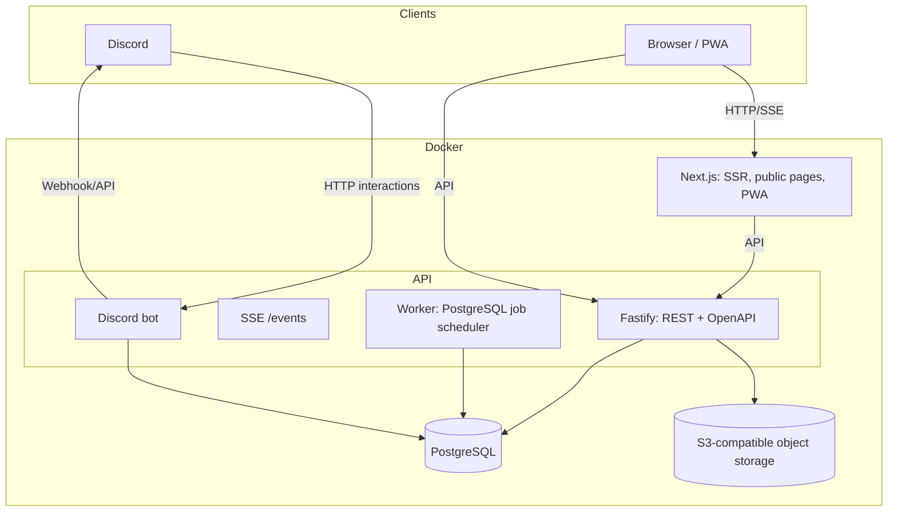
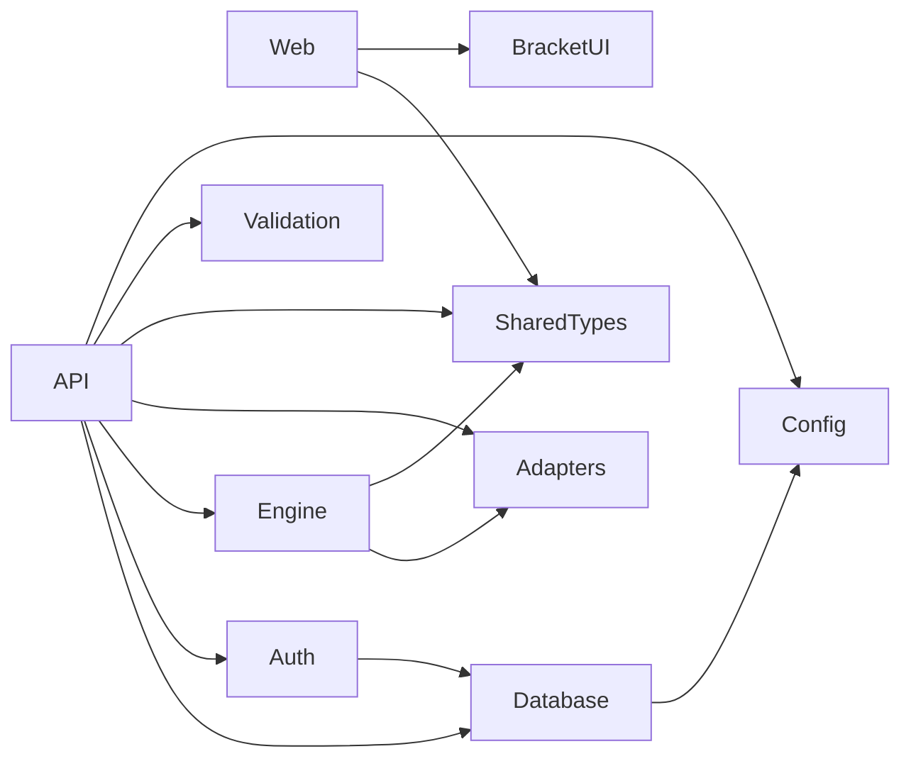
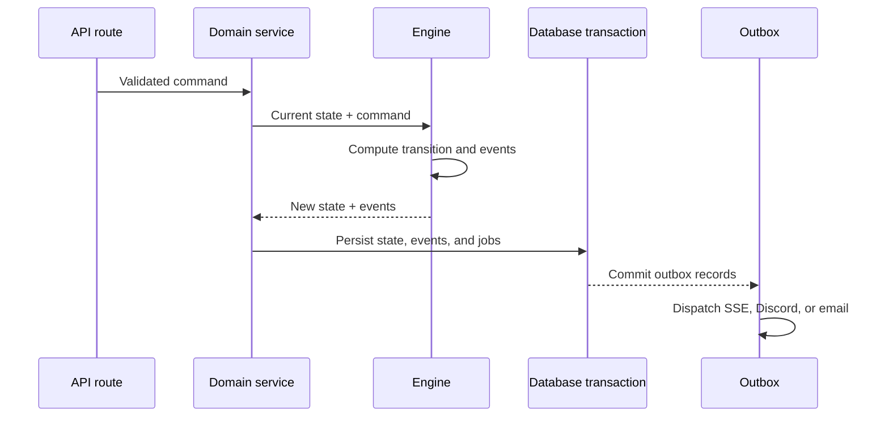

# Architecture

## Overview

OpenTournament is a **modular monolith** in a monorepo. It has two deployable applications, `web` and `api`, plus internal packages with explicit responsibilities. The scheduler worker and optional Discord bot are modules inside the API process (ADR-002 and ADR-030). Clients use REST and SSE, state lives in PostgreSQL, and files use S3-compatible storage.



## Monorepo structure

```text
opentournament/
├── apps/
│   ├── web/                # Next.js App Router, SSR, PWA
│   └── api/                # Fastify REST, SSE, worker, Discord bot
├── packages/
│   ├── tournament-engine/  # Pure deterministic tournament logic
│   ├── game-adapters/      # Typed game and template configuration
│   ├── bracket-ui/         # Reusable bracket components
│   ├── database/           # Drizzle schema, migrations, and seeds
│   ├── auth/               # Sessions, passwords, OAuth, RBAC helpers
│   ├── shared-types/       # Types shared by web and API
│   ├── validation/         # Boundary validation with Zod
│   └── config/             # Typed environment configuration
├── infrastructure/         # Deployment infrastructure
├── docs/                   # Architecture and product documentation
├── scripts/                # Development and operations scripts
└── tests/                  # Repository-level integration and E2E suites
```

## Request flow

1. The browser calls `apps/api` with its session cookie.
2. Authentication resolves the user; authorization resolves the effective role and checks the permission.
3. `packages/validation` validates untrusted input before database access.
4. Domain services call pure functions from `packages/tournament-engine` to compute transitions.
5. A PostgreSQL transaction persists state and domain events.
6. The same transaction records outbox jobs for SSE and notifications.

## Key decisions

| Decision                     | Reason                                                                          |
| ---------------------------- | ------------------------------------------------------------------------------- |
| Modular monolith             | One operational unit with explicit package boundaries and low self-hosting cost |
| Framework-independent engine | Determinism, extensive tests, and no storage coupling                           |
| Worker inside API            | Current jobs are lightweight; extraction remains possible                       |
| Discord bot inside API       | One process and reconnect-tolerant Discord gateway                              |
| SSE instead of WebSockets    | Updates are server-to-client; browser reconnection is built in                  |
| PostgreSQL queue/outbox      | Survives restarts without adding Redis                                          |
| Drizzle ORM                  | Typed SQL without a binary query engine and lower Docker friction               |

## Package dependency rules



- `tournament-engine` does not depend on HTTP, databases, storage, or Discord.
- `game-adapters` depends only on `shared-types`.
- `web` does not import `database` or `auth` directly.
- API routes validate and authorize; domain services own orchestration and transactions.

## Domain transaction lifecycle



The transactional outbox prevents committed state from losing its corresponding notifications when the process stops after the database commit.

## Evolution boundaries

- Extract the worker or Discord bot into separate processes without changing domain contracts.
- Adopt Redis and BullMQ only when load or distribution requires them.
- Add WebSockets if bidirectional features such as internal chat are introduced.
- Add a managed multi-tenant service with PostgreSQL RLS as defense in depth.
- Reuse `apps/web` in a future Tauri desktop application.

Continue with [API design](API_DESIGN.md), [data model](DATA_MODEL.md), [real-time architecture](REALTIME_ARCHITECTURE.md), [storage](STORAGE_STRATEGY.md), and [deployment](DEPLOYMENT.md).
