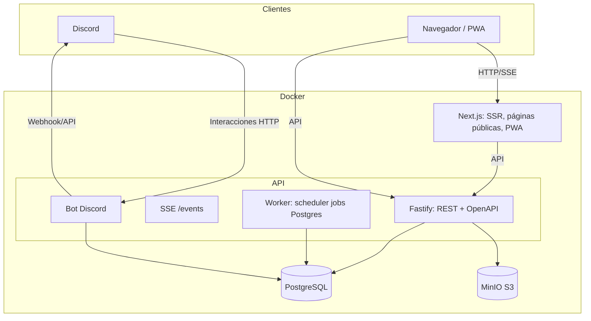
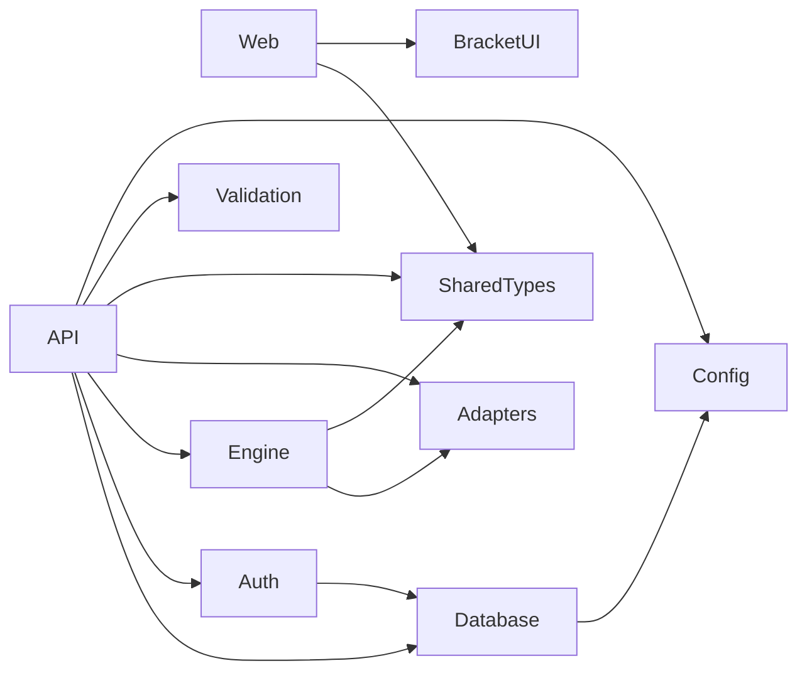
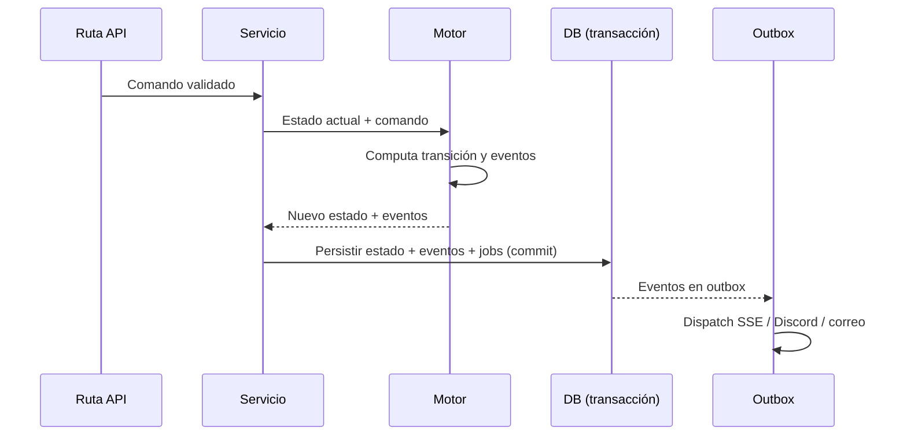

# Arquitectura

## 1. Resumen

OpenTournament es un **monolito modular** en un monorepo. Dos aplicaciones desplegables (`web` y `api`) y paquetes internos con responsabilidades claras. El worker (scheduler de jobs) y el bot de Discord son **módulos dentro de la API** (ADR-002, ADR-030). La comunicación con el cliente es REST + SSE; la persistencia es PostgreSQL; los archivos van a un bucket S3-compatible.



## 2. Estructura del monorepo

```text
opentournament/
├── apps/
│   ├── web/              # Next.js (App Router, SSR, PWA)
│   └── api/              # Fastify (REST, SSE, worker, bot Discord)
├── packages/
│   ├── tournament-engine/  # Motor puro, determinista
│   ├── game-adapters/      # Configuración tipada + genérico
│   ├── bracket-ui/         # Componentes de bracket reutilizables
│   ├── database/           # Esquema Drizzle, migraciones, seeds
│   ├── auth/               # Sesiones, contraseñas, OAuth, RBAC helpers
│   ├── shared-types/       # Tipos compartidos web/api
│   ├── validation/         # Validación de entrada (zod)
│   └── config/             # Variables de entorno y configuración tipada
├── infrastructure/         # Docker Compose, scripts de despliegue
├── docs/                   # Documentación (este árbol)
├── scripts/                # Scripts de desarrollo/operación
└── tests/                  # Suites de integración/E2E a nivel repo
```

## 3. Flujo de una petición

1. El navegador llama a la API (`apps/api`) con cookie de sesión.
2. Middleware de auth resuelve el usuario; middleware de autorización resuelve el rol efectivo y valida el permiso.
3. Los datos se validan con `packages/validation` (zod) antes de tocar la base.
4. El servicio de dominio usa `packages/tournament-engine` (funciones puras) para computar el nuevo estado.
5. La transacción persiste el estado y los eventos de dominio en PostgreSQL.
6. Se emiten eventos SSE y se encolan jobs/notificaciones en la misma transacción (outbox de eventos).

## 4. Decisiones clave y su racional

| Decisión | Racional |
| --- | --- |
| Monolito modular | Un solo deployable; costos de operación mínimos; límites claros por paquete |
| Motor separado del framework | Determinismo, tests extensivos, independencia de storage |
| Worker dentro de la API | Jobs ligeros (temporizadores y envíos); extracción futura documentada |
| Bot dentro de la API | Un solo proceso; gateway de Discord tolera reinicios con reconnect |
| SSE en vez de WebSockets | Actualizaciones unidireccionales; simplicidad y reconexión automática |
| Cola en PostgreSQL | Cero servicios extra; sobrevive reinicios; BullMQ/Redis como evolución |
| Drizzle | SQL tipado, sin query engine binario, menos fricción en Docker |

## 5. Paquetes y dependencias



- `tournament-engine` no depende de HTTP, base de datos ni Discord.
- `game-adapters` solo depende de `shared-types`.
- `web` no importa `database` ni `auth` directamente.

## 6. Ciclo de vida de una transacción de dominio



El outbox garantiza que las notificaciones y eventos no se pierdan si el proceso cae después del commit.

## 7. Evolución futura

- Extraer `worker` y `bot` a procesos separados sin cambios de dominio (interfaces ya aisladas).
- Redis + BullMQ cuando la carga o la distribución lo exijan.
- WebSockets si se incorpora chat interno.
- Servicio cloud administrado (instancias multi-tenant) con RLS de PostgreSQL como refuerzo.
- Aplicación Tauri reutilizando `apps/web`.

Detalle por capa: [API](API_DESIGN.md), [Datos](DATA_MODEL.md), [Tiempo real](REALTIME_ARCHITECTURE.md), [Storage](STORAGE_STRATEGY.md), [Despliegue](DEPLOYMENT.md).
