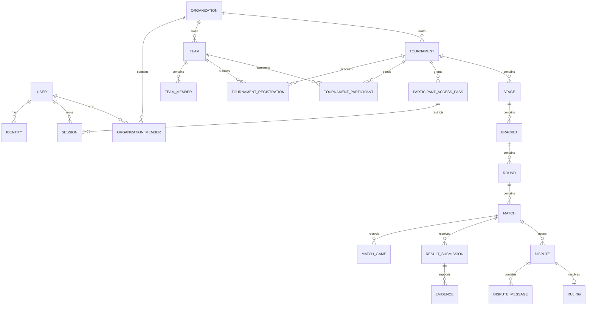

# Data model

This document describes the **implemented** PostgreSQL model. The authoritative schema is [`packages/database/src/schema.ts`](../packages/database/src/schema.ts); every schema change must update a Drizzle migration and this document in the same pull request.

## Conventions

- PostgreSQL 16 with Drizzle ORM.
- UUID primary keys use PostgreSQL random UUID defaults unless a table explicitly uses a serial identifier.
- Timestamps use `timestamptz` in UTC.
- `users`, `organizations`, `teams`, and `tournaments` support soft deletion through `deleted_at`.
- Organization-owned resources are scoped through their organization, tournament, or team relationship.
- JSONB stores versioned configuration and game-specific documents; Zod and TypeScript contracts validate them before persistence.
- Passwords, tokens, OAuth data, and evidence follow [SECURITY_MODEL.md](SECURITY_MODEL.md).

## Relationship overview



## Identity and access

| Table                       | Purpose                                                                    | Important constraints                                              |
| --------------------------- | -------------------------------------------------------------------------- | ------------------------------------------------------------------ |
| `users`                     | Account identity, display profile, locale, verification, and soft deletion | Email is unique when present                                       |
| `identities`                | OAuth provider identities linked to users                                  | Unique `(provider, provider_sub)`                                  |
| `password_reset_tokens`     | One-time password recovery tokens                                          | Only token hashes are stored                                       |
| `email_verification_tokens` | One-time email verification tokens                                         | Only token hashes are stored                                       |
| `sessions`                  | Account and participant-pass sessions                                      | Unique token hash; optional pass scope                             |
| `participant_access_passes` | Revocable one-tournament, one-team access                                  | Unique token hash; expiration, revocation, and last-use timestamps |

A participant pass has a dedicated pseudonymous `actor_user_id`. Sessions linked to the pass remain auditable and can be revoked by deleting or revoking the pass.

## Organizations and teams

| Table                  | Purpose                                                                    | Important constraints                                       |
| ---------------------- | -------------------------------------------------------------------------- | ----------------------------------------------------------- |
| `organizations`        | Tenant boundary, public identity, and organization settings                | Unique slug; soft delete                                    |
| `organization_members` | User membership and `owner`, `admin`, or `member` role                     | Unique `(organization_id, user_id)`                         |
| `teams`                | Permanent teams and tournament-specific one-player or multi-player entries | Organization scope, captain, optional game key, soft delete |
| `team_members`         | Captain, member, and substitute assignments                                | Unique `(team_id, user_id)`                                 |
| `game_adapters`        | Persisted adapter registry metadata                                        | Unique adapter key                                          |

Individual competitors use a team with one member. There is no separate player-profile table in the implemented schema.

## Tournament configuration

`tournaments` owns the public identity and competition configuration:

| Field group  | Stored content                                                                                     |
| ------------ | -------------------------------------------------------------------------------------------------- |
| Identity     | Organization, adapter key, slug, name, description, and rules                                      |
| Lifecycle    | Visibility, status, publication, cancellation, start, end, and soft deletion                       |
| Competition  | Format, capacity, and `series_config`                                                              |
| Registration | `registration_config` with approval and optional window                                            |
| Check-in     | `checkin_config` with window and delay tolerance                                                   |
| Timing       | Result-confirmation and dispute windows                                                            |
| Settings     | Grand-final reset, in-person flag, reporting mode, template identity/version, and typed game rules |

`TournamentSettingsDocument` in the schema defines the implemented Smash Ultimate and League of Legends configuration documents. Add a new game document as a discriminated union member and validate it at both the API boundary and adapter layer.

Supporting tables:

| Table                      | Purpose                                                                         |
| -------------------------- | ------------------------------------------------------------------------------- |
| `tournament_staff`         | Tournament-specific `admin`, `referee`, and `moderator` assignments             |
| `tournament_registrations` | Team requests with pending, approved, waitlisted, rejected, or cancelled status |
| `tournament_participants`  | Effective seeded bracket participants                                           |
| `check_ins`                | One check-in per tournament and team                                            |
| `stream_links`             | Twitch, YouTube, or other public stream URLs                                    |

## Competitive structure

```text
Tournament
└── Stage
    └── Bracket (winners, losers, or final)
        └── Round
            └── Match
```

| Table         | Purpose                                          | Important fields                                              |
| ------------- | ------------------------------------------------ | ------------------------------------------------------------- |
| `stages`      | Ordered tournament phases                        | Type, format, status, configuration, position                 |
| `brackets`    | Winners, losers, or final bracket inside a stage | Type, configuration, generation time                          |
| `rounds`      | Numbered rounds inside a bracket                 | Unique `(bracket_id, number)`                                 |
| `matches`     | Engine-addressed match state                     | Participants, status, series, schedule, result JSONB, version |
| `match_games` | Generic per-map or per-game rows                 | Unique `(match_id, number)`                                   |

`matches.engine_id` links persisted matches to deterministic engine output. `matches.version` supports optimistic concurrency. The `result` JSONB stores the common winner and score plus optional typed `games` for Smash or `lolGames` for League of Legends.

## Results, evidence, and disputes

| Table                | Purpose                              | Important constraints                                                  |
| -------------------- | ------------------------------------ | ---------------------------------------------------------------------- |
| `result_submissions` | One participant report for a match   | Unique `(match_id, team_id)`; nullable team for eligible staff reports |
| `evidence`           | Screenshot or external-link metadata | Belongs to one submission; object content stays outside PostgreSQL     |
| `disputes`           | Result conflict or requested review  | Match scope, status, optional assignee                                 |
| `dispute_messages`   | Append-only discussion               | Author and timestamp                                                   |
| `rulings`            | Final audited decision               | Exactly one ruling per dispute                                         |

A confirmed match result is the aggregate used by the bracket. Submissions remain as the audit source. Rulings record the selected evidence IDs and final score or draw.

## Operations and audit

| Table           | Purpose                                                                    |
| --------------- | -------------------------------------------------------------------------- |
| `audit_logs`    | Append-only critical-action history with before/after documents and reason |
| `jobs`          | PostgreSQL-backed scheduled and retried work queue                         |
| `notifications` | User notification inbox                                                    |
| `settings`      | Instance-level JSON settings by key                                        |
| `demo_flags`    | Idempotent demo-seed markers                                               |

Jobs use status, attempts, `locked_until`, and `lock_token` for safe worker claims.

## Main transitions

| Entity       | Allowed lifecycle                                                                     |
| ------------ | ------------------------------------------------------------------------------------- |
| Tournament   | `draft → open → checkin_open → in_progress → finalized`; draft/open may cancel        |
| Registration | `pending → approved/rejected/waitlisted`; approved may cancel; waitlisted may approve |
| Match        | `scheduled → in_progress → finalized`; may become walkover, disputed, or voided       |
| Dispute      | `open → in_review → resolved`                                                         |

Domain services and the tournament engine validate transitions; the database transaction persists state, audit information, and outbox work together.

## Deletion and retention

- Soft-delete users, organizations, teams, and tournaments.
- Organization deletion must not erase evidence or audit history.
- Do not hard-delete a team after it has played a match; deactivate it instead.
- Hard deletion is limited to expired tokens/sessions, retention-expired unused evidence, and pruned failed jobs.
- Participant-pass revocation invalidates its linked sessions.

## Important indexes

The schema currently indexes:

- Organizations by slug and users by email.
- Tournaments by `(organization_id, status)`.
- Registrations and participants by tournament and status.
- Matches by tournament/status and round.
- Result submissions by match/status.
- Notifications by user/read state.
- Jobs by status/run time.
- Audit events by resource type and ID.

## Schema change checklist

1. Update `packages/database/src/schema.ts`.
2. Generate and inspect the Drizzle migration.
3. Update shared types, validation, API services, and seed data.
4. Add migration and behavior tests.
5. Update this document and any affected API or authorization documentation.
6. Verify both a migrated database and a clean installation.
