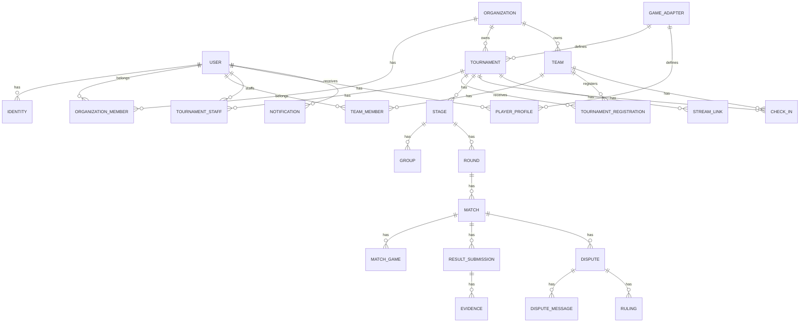

# Modelo de datos

## 1. Convenciones

- Base: PostgreSQL 16+ con Drizzle ORM (`packages/database`).
- Identificadores: `uuid` (v4) generados con `gen_random_uuid()` (supuesto AF-11).
- Timestamps: `timestamptz` en UTC; columnas `created_at`, `updated_at`.
- Soft delete: columna `deleted_at` en entidades de negocio; borrado físico solo donde se indica.
- Multi-organización: toda entidad de negocio de una organización lleva `organization_id`; las consultas siempre se filtran por membresía (app layer; RLS como refuerzo futuro).
- Sensible: contraseñas, tokens de sesión, tokens OAuth y evidencias se tratan según [docs/SECURITY_MODEL.md](SECURITY_MODEL.md).

## 2. Diagrama ERD

## 3. Entidades

### 3.1 Usuarios e identidades

**User**

| Campo | Tipo | Notas |
| --- | --- | --- |
| id | uuid PK | |
| email | citext único | null si solo Discord sin correo público |
| password_hash | text | null si solo Discord |
| display_name | text | nombre público |
| avatar_url | text | bucket público |
| locale | text | `es` o `en` |
| email_verified_at | timestamptz null | |
| deleted_at | timestamptz null | soft delete |

**Identity** — identidades OAuth vinculadas.

| Campo | Tipo | Notas |
| --- | --- | --- |
| id | uuid PK | |
| user_id | uuid FK | |
| provider | enum | `discord` (futuro: `google`, `github`) |
| provider_sub | text | id del proveedor |
| provider_email | text | correo reportado por el proveedor |
| UNIQUE(provider, provider_sub) | | |

**PlayerProfile** — IDs de juego por adaptador.

| Campo | Tipo | Notas |
| --- | --- | --- |
| id | uuid PK | |
| user_id | uuid FK | |
| game_adapter_id | uuid FK | |
| player_id | text | Riot ID, SteamID64, invocador+región |
| region | text null | |
| UNIQUE(user_id, game_adapter_id) | | |

### 3.2 Organizaciones

**Organization**

| Campo | Tipo | Notas |
| --- | --- | --- |
| id | uuid PK | |
| slug | text único | |
| name | text | |
| logo_url | text null | |
| description | text null | |
| settings | jsonb | allow_member_tournaments, locale |
| deleted_at | timestamptz null | |

**OrganizationMember**

| Campo | Tipo | Notas |
| --- | --- | --- |
| id | uuid PK | |
| organization_id | uuid FK | |
| user_id | uuid FK | |
| role | enum | `owner`, `admin`, `member` |
| UNIQUE(organization_id, user_id) | | |

**Role / Permission** — no hay tablas separadas en el MVP; el catálogo de permisos es código tipado (ADR-008) y los roles se representan por enum. Se documenta en [AUTHORIZATION_MODEL.md](AUTHORIZATION_MODEL.md). Si la gestión dinámica de roles se requiere más adelante, se migra a tablas `role`/`permission`/`role_permission`.

### 3.3 Juegos y equipos

**GameAdapter**

| Campo | Tipo | Notas |
| --- | --- | --- |
| id | uuid PK | |
| key | text único | `generic`, `valorant`, `cs2`, `lol` |
| name | text | |
| icon_url | text | |
| config | jsonb | esquema tipado: team sizes, subs, formats, maps, scoring, draws, fields |
| enabled | boolean | |

**Team**

| Campo | Tipo | Notas |
| --- | --- | --- |
| id | uuid PK | |
| organization_id | uuid FK | |
| name | text | |
| tag | text null | |
| logo_url | text null | |
| is_permanent | boolean | false = efímero |
| captain_id | uuid FK (user) | |
| game_adapter_id | uuid FK null | si es permanente y específico |
| deleted_at | timestamptz null | |

**TeamMember**

| Campo | Tipo | Notas |
| --- | --- | --- |
| id | uuid PK | |
| team_id | uuid FK | |
| user_id | uuid FK | |
| role | enum | `captain`, `member`, `substitute` |
| UNIQUE(team_id, user_id) | | |

### 3.4 Torneos

**Tournament**

| Campo | Tipo | Notas |
| --- | --- | --- |
| id | uuid PK | |
| organization_id | uuid FK | índice |
| game_adapter_id | uuid FK | |
| slug | text | para URL pública |
| name | text | |
| description | text | |
| rules | text | reglas publicadas |
| format | enum | `single_elimination`, `double_elimination` |
| visibility | enum | `public`, `unlisted` |
| status | enum | `draft`, `open`, `checkin_open`, `in_progress`, `finalized`, `cancelled` |
| capacity | int | 8–512 |
| series_config | jsonb | bo1/bo3/bo5/personalizado, draws_allowed |
| registration_config | jsonb | window, manual_approval, waitlist |
| checkin_config | jsonb | window, deadline, delay_tolerance_minutes |
| timing_config | jsonb | result_confirm_minutes, dispute_window_minutes |
| settings | jsonb | grand_final_reset, presencial (lobby opcional) |
| starts_at / ends_at | timestamptz | |
| published_at | timestamptz null | |
| cancelled_at | timestamptz null | |
| deleted_at | timestamptz null | |

**TournamentStaff**

| Campo | Tipo | Notas |
| --- | --- | --- |
| id | uuid PK | |
| tournament_id | uuid FK | |
| user_id | uuid FK | |
| role | enum | `admin`, `referee`, `moderator` |
| UNIQUE(tournament_id, user_id, role) | | |

**TournamentRegistration**

| Campo | Tipo | Notas |
| --- | --- | --- |
| id | uuid PK | |
| tournament_id | uuid FK | |
| team_id | uuid FK | |
| status | enum | `pending`, `approved`, `waitlisted`, `rejected`, `cancelled` |
| approved_by | uuid FK null | |
| waitlist_position | int null | |
| created_at / updated_at | timestamptz | |
| UNIQUE(tournament_id, team_id) | | |

**TournamentParticipant** — equipo/participante efectivo en el bracket.

| Campo | Tipo | Notas |
| --- | --- | --- |
| id | uuid PK | |
| tournament_id | uuid FK | |
| registration_id | uuid FK | |
| team_id | uuid FK | |
| seed | int null | |
| checked_in | boolean | |
| status | enum | `active`, `eliminated`, `walkover`, `disqualified`, `winner` |

**CheckIn**

| Campo | Tipo | Notas |
| --- | --- | --- |
| id | uuid PK | |
| tournament_id | uuid FK | |
| team_id | uuid FK | |
| user_id | uuid FK | quién hizo check-in |
| checked_in_at | timestamptz | |
| UNIQUE(tournament_id, team_id) | | |

### 3.5 Estructura competitiva

**Stage** — fase del torneo (grupos/playoffs futuro; en MVP: bracket único).

| Campo | Tipo | Notas |
| --- | --- | --- |
| id | uuid PK | |
| tournament_id | uuid FK | |
| type | enum | `bracket` (futuro: `group`, `playoff`) |
| format | enum | `single_elimination`, `double_elimination` |
| status | enum | `pending`, `active`, `completed` |
| config | jsonb | |

**Group** — futuro (round-robin); tabla prevista, sin uso en MVP.

**Bracket**

| Campo | Tipo | Notas |
| --- | --- | --- |
| id | uuid PK | |
| stage_id | uuid FK | |
| type | enum | `winners`, `losers`, `final` |
| config | jsonb | |
| generated_at | timestamptz | |

**Round**

| Campo | Tipo | Notas |
| --- | --- | --- |
| id | uuid PK | |
| bracket_id | uuid FK | |
| number | int | |
| name | text | ej. "Semifinal" |
| status | enum | `pending`, `active`, `completed` |

**Match**

| Campo | Tipo | Notas |
| --- | --- | --- |
| id | uuid PK | |
| round_id | uuid FK | |
| tournament_id | uuid FK | índice |
| position | int | posición en el bracket |
| home_participant_id / away_participant_id | uuid FK null | |
| status | enum | `scheduled`, `in_progress`, `finalized`, `disputed`, `voided`, `walkover` |
| series | jsonb | BO config, maps, draw_allowed |
| lobby_url | text null | |
| maps | jsonb null | veto externo registrado |
| scheduled_at | timestamptz null | |
| result | jsonb null | winner_participant_id, score, draws |
| reschedule_count | int | |
| version | int | optimistic locking |

**MatchGame** — resultado por mapa/partida dentro de la serie.

| Campo | Tipo | Notas |
| --- | --- | --- |
| id | uuid PK | |
| match_id | uuid FK | |
| number | int | |
| map | text null | |
| home_score / away_score | int null | |
| winner | uuid FK null | |

### 3.6 Resultados, evidencias y disputas

**ResultSubmission**

| Campo | Tipo | Notas |
| --- | --- | --- |
| id | uuid PK | |
| match_id | uuid FK | |
| team_id | uuid FK | quién reporta |
| reported_by | uuid FK | usuario |
| result | jsonb | score, winner, draws |
| status | enum | `pending`, `confirmed`, `conflicted`, `escalated` |
| submitted_at | timestamptz | |

**Evidence**

| Campo | Tipo | Notas |
| --- | --- | --- |
| id | uuid PK | |
| result_submission_id | uuid FK | |
| kind | enum | `screenshot`, `link` |
| url | text | bucket privado o enlace externo |
| mime_type | text | |
| size_bytes | int | |
| uploaded_by | uuid FK | |

**Dispute**

| Campo | Tipo | Notas |
| --- | --- | --- |
| id | uuid PK | |
| match_id | uuid FK | |
| opened_by | uuid FK | |
| reason | enum | `result_conflict`, `captain_request`, `system` |
| status | enum | `open`, `in_review`, `resolved` |
| assignee_id | uuid FK null | árbitro |
| opened_at / resolved_at | timestamptz | |

**DisputeMessage**

| Campo | Tipo | Notas |
| --- | --- | --- |
| id | uuid PK | |
| dispute_id | uuid FK | |
| author_id | uuid FK | |
| body | text | |
| created_at | timestamptz | |

**Ruling**

| Campo | Tipo | Notas |
| --- | --- | --- |
| id | uuid PK | |
| dispute_id | uuid FK | |
| resolved_by | uuid FK | árbitro/admin |
| decision | jsonb | resultado final aplicado |
| rationale | text | motivo |
| considered_evidence | jsonb | IDs de evidencias |
| created_at | timestamptz | |

**Penalty** — diferido (fase 6); se prevé en el modelo futuro sin tabla en el MVP.

### 3.7 Notificaciones, auditoría y extras

**Notification**

| Campo | Tipo | Notas |
| --- | --- | --- |
| id | uuid PK | |
| user_id | uuid FK | |
| type | text | |
| payload | jsonb | |
| read_at | timestamptz null | |
| created_at | timestamptz | índice por (user_id, read_at) |

**AuditLog**

| Campo | Tipo | Notas |
| --- | --- | --- |
| id | bigserial PK | |
| organization_id | uuid FK null | |
| actor_id | uuid FK null | |
| action | text | |
| resource_type / resource_id | text/uuid | |
| before / after | jsonb null | |
| reason | text null | |
| created_at | timestamptz | append-only, índice por (resource_type, resource_id) |

**Webhook** — diferido; tabla prevista (id, organization_id, url, secret, events, enabled).

**StreamLink**

| Campo | Tipo | Notas |
| --- | --- | --- |
| id | uuid PK | |
| tournament_id | uuid FK | |
| label | text | |
| url | text | Twitch/YouTube |
| platform | enum | `twitch`, `youtube`, `other` |

**Job** (cola de trabajos en PostgreSQL)

| Campo | Tipo | Notas |
| --- | --- | --- |
| id | bigserial PK | |
| kind | text | |
| run_at | timestamptz | índice |
| payload | jsonb | |
| status | enum | `pending`, `running`, `done`, `failed`, `cancelled` |
| attempts | int | |
| last_error | text null | |
| locked_until | timestamptz null | |
| created_at | timestamptz | |

## 4. Estados y transiciones principales

| Entidad | Estados |
| --- | --- |
| Tournament | draft → open → checkin_open → in_progress → finalized; draft/open → cancelled |
| Registration | pending → approved/rejected; approved → cancelled; waitlisted → approved |
| Match | scheduled → in_progress → finalized; scheduled → voided/walkover; any → disputed (vía disputa) |
| Dispute | open → in_review → resolved |

Las transiciones se validan en el motor y se persisten en la misma transacción que los eventos de dominio.

## 5. Reglas de eliminación

- Soft delete: User, Organization, Team, Tournament.
- En cascada lógica: al eliminar una organización, sus torneos/equipos quedan con `deleted_at` (no se borran evidencias ni audit log).
- Hard delete solo para: evidencias no utilizadas dentro de la ventana de retención, sesiones revocadas, jobs fallidos depurados.
- Restricción: no se elimina un equipo con partidas jugadas; se desactiva.

## 6. Auditoría y datos sensibles

- AuditLog es append-only; guarda `before`/`after` de cambios críticos.
- Sensibles: `password_hash` (Argon2id), `session` (hash), tokens OAuth (cifrados), evidencias (bucket privado con URLs firmadas).
- Los eventos de dominio del motor se persisten para trazabilidad y futura reconstrucción.

## 7. Índices recomendados

- `tournament(organization_id, status)`, `match(tournament_id, status)`, `match(round_id, position)`.
- `registration(tournament_id, status)`, `participant(tournament_id, team_id)`.
- `notification(user_id, read_at)`, `audit_log(resource_type, resource_id)`, `job(status, run_at)`.
