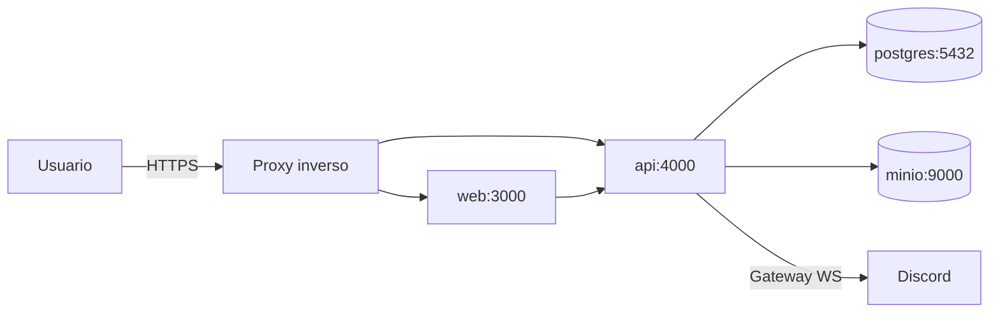

# Despliegue

## 1. Objetivo

Una instalación nueva, después de inicializar `.env` y generar `SESSION_SECRET`, debe poder
iniciarse con:

```bash
docker compose up -d
```

Los servicios son: `web` (Next.js), `api` (Fastify + worker + bot), `postgres` (PostgreSQL 16) y `minio` (S3-compatible).

## 2. Topología



- En desarrollo el proxy puede omitirse; en producción se recomienda Caddy, Traefik o Nginx con TLS.
- Solo `web`, `api` y el proxy son públicos; `postgres` y `minio` viven en la red interna de Docker.

## 3. Servicios y volúmenes

| Servicio | Imagen                   | Volúmenes               |
| -------- | ------------------------ | ----------------------- |
| postgres | postgres:16-alpine       | `pgdata` (persistencia) |
| minio    | minio/minio              | `miniodata`             |
| api      | build local (`apps/api`) | ninguno (stateless)     |
| web      | build local (`apps/web`) | ninguno (stateless)     |

## 4. Variables de entorno

Ver [.env.example](../.env.example). Variables críticas:

- `DATABASE_URL` — conexión a PostgreSQL.
- `SESSION_SECRET` — secreto único generado con `openssl rand -hex 32`.
- `S3_*` — endpoint, bucket y credenciales.
- `DISCORD_*` — opcionales; sin ellas, auth por correo y sin bot.
- `SMTP_*` — opcionales.

## 5. Migraciones y seeds

- La API aplica las migraciones Drizzle durante el arranque antes de aceptar tráfico.
- El seed de demostración es idempotente y sólo se ejecuta con `SEED_DEMO_DATA=true`; Compose lo
  mantiene desactivado por defecto.

## 6. Health checks

- `GET /healthz` en API (conectividad con PostgreSQL).
- `GET /` en web.
- Compose healthchecks para postgres, MinIO, API y web; cada servicio espera a que sus dependencias
  estén saludables.

## 7. Respaldos

- PostgreSQL: `pg_dump` programado (cron) con retención configurable.
- MinIO: `mc mirror` del bucket a otro destino (o backup del volumen).
- Restauración documentada en [SELF_HOSTING.md](SELF_HOSTING.md).

## 8. Actualizaciones

1. Leer el changelog y las notas de release.
2. Respaldo de base de datos y bucket.
3. `docker compose pull` (o rebuild local) y `docker compose up -d`.
4. Ejecutar migraciones (el job de arranque las aplica).
5. Verificar health checks y una ruta pública.

## 9. CI/CD

Los workflows de GitHub Actions disponibles son:

- **CI (push/PR):** lint, typecheck, tests unitarios e integración, build, `pnpm audit` y
  Playwright con PostgreSQL.
- **CodeQL:** análisis estático de JavaScript/TypeScript.
- **Compose clean-install smoke (manual):** genera una configuración efímera segura, construye y
  levanta web, API, PostgreSQL y MinIO desde cero, verifica las rutas saludables y destruye los
  volúmenes al finalizar.
- **Publish container images (tags):** un tag `vX.Y.Z` construye API y web para AMD64/ARM64,
  publica tags semver en GHCR, adjunta SBOM y procedencia verificable y crea el GitHub Release con
  notas generadas después de publicar correctamente ambas imágenes.
- **OWASP ZAP baseline (manual):** levanta una instalación aislada, ejecuta un análisis pasivo
  contra la web pública y conserva el reporte como artefacto sin crear issues automáticamente.

Antes del primer release se debe verificar que ambos paquetes de GHCR tengan visibilidad pública.
El primer tag sigue pendiente; el workflow no crea releases ni paquetes antes de recibir uno.

### 9.1 Publicar una versión

1. Confirmar que CI, CodeQL, el smoke de Compose y el baseline ZAP estén verdes en `main`.
2. Actualizar la versión y mover las entradas relevantes de `CHANGELOG.md` a la nueva versión.
3. Crear y subir un tag anotado: `git tag -a vX.Y.Z -m "OpenTournament vX.Y.Z"` y
   `git push origin vX.Y.Z`.
4. Esperar a que **Publish container images** termine; el GitHub Release solo se crea si API y web
   se publicaron y atestaron correctamente.
5. En el primer release, marcar `opentournament-api` y `opentournament-web` como públicos en GHCR y
   verificar una instalación usando los tags exactos publicados.

## 10. Dimensionamiento

| Escenario                   | Recursos                      |
| --------------------------- | ----------------------------- |
| Mínimo (8–32 participantes) | 2 vCPU, 2 GB RAM, 20 GB disco |
| Típico (128 participantes)  | 2 vCPU, 4 GB RAM, 40 GB disco |
| Smoke (256 concurrentes)    | 4 vCPU, 8 GB RAM              |

## 11. Despliegue económico (referencia futura)

- Instancia oficial futura: VPS pequeño o contenedor en proveedor económico; R2 para storage (egress gratis); sin dominios adicionales.
- El proyecto permanece independiente del proveedor (solo se usa infraestructura commodity).
