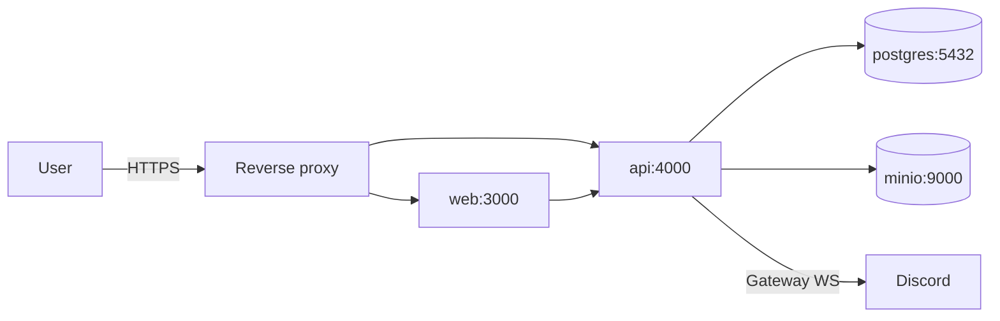

# Deployment

## Goal

After copying `.env.example` to `.env` and generating a unique `SESSION_SECRET`, a new installation must start with:

```bash
docker compose up -d
```

The stack contains `web` (Next.js), `api` (Fastify, worker, and optional bot), `postgres` (PostgreSQL 16), and `minio` (S3-compatible object storage).

## Topology



A reverse proxy is optional during development. Production deployments should use Caddy, Traefik, or Nginx with TLS. Only the proxy, web, and API should be publicly reachable; PostgreSQL and MinIO belong on the private Docker network.

## Services and volumes

| Service    | Image                        | Persistent volume |
| ---------- | ---------------------------- | ----------------- |
| `postgres` | `postgres:16-alpine`         | `pgdata`          |
| `minio`    | `minio/minio`                | `miniodata`       |
| `api`      | Local build or release image | None; stateless   |
| `web`      | Local build or release image | None; stateless   |

## Environment variables

See [`.env.example`](../.env.example). The critical groups are:

- `DATABASE_URL` and `DATABASE_URL_DOCKER`: PostgreSQL connections from the host and Compose network.
- `SESSION_SECRET`: a unique secret generated with `openssl rand -hex 32`.
- `S3_*`: object-storage endpoint, bucket, and credentials.
- `DISCORD_*`: optional OAuth and bot configuration.
- `SMTP_*`: optional email delivery configuration.
- `SEED_DEMO_DATA`: opt-in demo seed; disabled by default.

## Migrations and seed data

The API applies Drizzle migrations during startup before accepting traffic. The demo seed is idempotent and runs only when `SEED_DEMO_DATA=true`.

## Health checks

- API: `GET /healthz`, including PostgreSQL connectivity.
- Web: `GET /`.
- Compose checks PostgreSQL, MinIO, API, and web and waits for healthy dependencies before starting each dependent service.

## Backups

- PostgreSQL: schedule `pg_dump` with an appropriate retention policy.
- MinIO: mirror the bucket with `mc mirror` or back up its volume.
- Test restoration periodically by following [SELF_HOSTING.md](SELF_HOSTING.md).

## Updating an installation

1. Read the changelog and release notes.
2. Back up PostgreSQL and object storage.
3. Update the pinned image tags or local checkout.
4. Run `docker compose pull` when using release images.
5. Run `docker compose up -d`; startup applies migrations.
6. Verify health checks and one public tournament route.

## CI/CD workflows

GitHub Actions provides:

- **CI (push and pull request):** lint, type checking, unit and integration tests, build, `pnpm audit`, and Playwright with PostgreSQL.
- **CodeQL:** JavaScript and TypeScript static analysis.
- **Compose clean-install smoke (manual):** creates an isolated configuration, builds and starts the full stack, checks health routes, and removes its volumes.
- **Publish container images (version tags):** a `vX.Y.Z` tag builds API and web images for AMD64 and ARM64, publishes semantic-version tags to GHCR, attaches an SBOM and verifiable provenance, and creates a GitHub Release after both images succeed.
- **OWASP ZAP baseline (manual):** starts an isolated stack, passively scans the public web application, and stores the report without automatically opening issues.

GHCR packages used for public releases must have public visibility.

### Publishing a release

1. Confirm that CI, CodeQL, the Compose smoke test, and the ZAP baseline pass on `main`.
2. Update versions and `CHANGELOG.md`; check the pull request labels used by `.github/release.yml`.
3. Create and push an annotated tag:
   ```bash
   git tag -a vX.Y.Z -m "OpenTournament vX.Y.Z"
   git push origin vX.Y.Z
   ```
4. Wait for **Publish container images**. If the tag push cannot trigger Actions, run the workflow manually with the existing `vX.Y.Z` tag; it validates the tag and builds that exact checkout.
5. Verify that `opentournament-api` and `opentournament-web` are public in GHCR and test an installation with the exact published tags.

## Capacity reference

| Scenario                         | Suggested resources          |
| -------------------------------- | ---------------------------- |
| Minimum, 8–32 participants       | 2 vCPU, 2 GB RAM, 20 GB disk |
| Typical, 128 participants        | 2 vCPU, 4 GB RAM, 40 GB disk |
| Load smoke, 256 concurrent users | 4 vCPU, 8 GB RAM             |

## Low-cost deployment direction

A future managed instance may run on a small VPS or low-cost container provider with R2-compatible storage. The project remains provider-independent and relies on commodity PostgreSQL and S3-compatible infrastructure.
