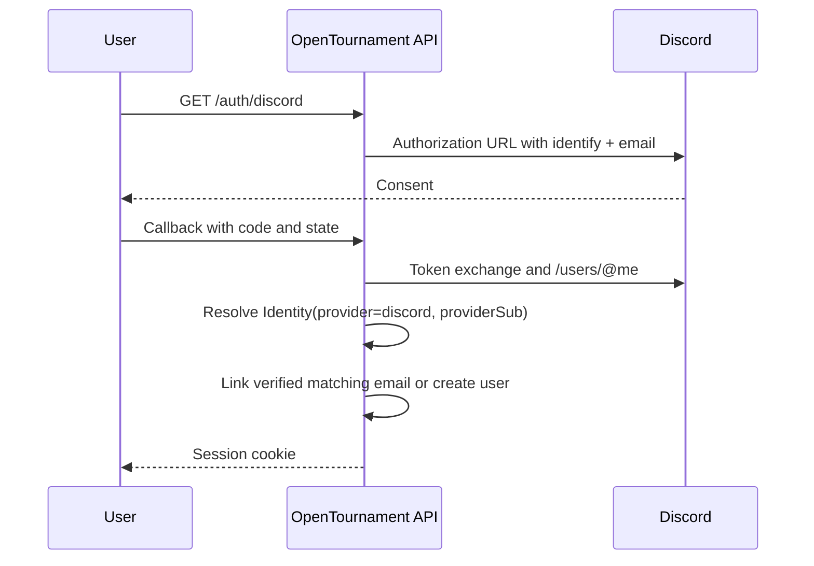

# Optional Discord integration

Discord is an opt-in adapter around the core product. An instance without Discord credentials must retain public tournaments, email accounts, participant passes, reporting, and arbitration.

## Capabilities

- Discord OAuth login.
- Signed HTTP interaction endpoint.
- Optional `/checkin` and `/status` slash commands.
- Optional outgoing webhook notifications.
- No required Discord roles, private channels, or Discord-native result reporting.

## OAuth flow

Existing identities sign in directly. A verified email may link to an existing verified account. Otherwise OpenTournament creates a separate user. Discord access material never reaches the frontend.

## Interactions and commands

`POST /api/v1/discord/interactions` verifies `X-Signature-Ed25519` and `X-Signature-Timestamp` with `DISCORD_PUBLIC_KEY`.

Configured instances register application commands through the Discord REST API:

- `/checkin <tournament-code>`: checks in the eligible captain’s participant.
- `/status <tournament-code>`: returns tournament state and relevant participant information.

The implementation uses signed HTTP interactions rather than requiring a persistent gateway connection.

## Notifications

Configured webhooks may announce:

- Registration and check-in windows.
- Match reminders and lobby information.
- Submitted or confirmed results.
- New disputes and rulings.
- Final standings.

Notifications contain links and public summaries, never private evidence or access-pass secrets.

## Self-hosting setup

1. Create a Discord application in the [Developer Portal](https://discord.com/developers/applications).
2. Add `${API_URL}/api/v1/auth/discord/callback` with `identify` and `email` scopes.
3. Copy the application ID, client secret, public key, and optional bot/webhook credentials.
4. Set the matching `DISCORD_*` variables in `.env`.
5. Restart the API and verify OAuth and an interaction signature.

See [SELF_HOSTING.md](SELF_HOSTING.md).

## Security

- Verify every interaction signature before parsing commands.
- Keep client secrets and bot tokens only in backend configuration.
- Resolve platform users through the stored `Identity → User` relationship.
- Respect Discord rate limits.
- Never send evidence, session cookies, CSRF tokens, or participant-pass secrets to Discord.

## Deferred scope

- Automatic role and channel creation.
- Private match channels.
- Result submission from Discord.
- Interactive bot configuration in the web UI.
- Mandatory Discord dependency.
