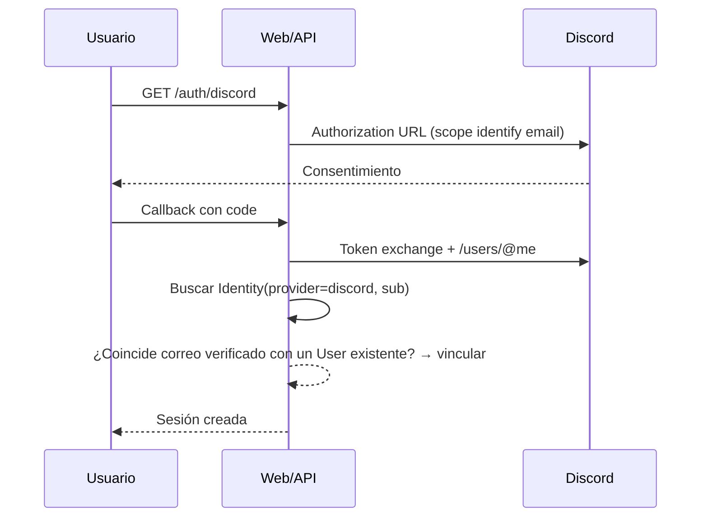

# Integración con Discord

## 1. Alcance del MVP

- Discord OAuth para iniciar sesión (ADR-013).
- Bot de notificaciones y comandos slash `/checkin` y `/status` (ADR-023).
- Configuración por instancia vía variables de entorno (`DISCORD_CLIENT_ID`, `DISCORD_CLIENT_SECRET`, `DISCORD_BOT_TOKEN`).
- Sin creación de roles, canales ni reporte de resultados desde Discord en el MVP (fase 6).

## 2. OAuth

Reglas:
- Si `identity` existe → login directo.
- Si no existe pero el correo de Discord coincide con una cuenta verificada → se vincula.
- Si no coincide → se crea una cuenta nueva (o se solicita vincular tras verificar el correo).
- Los tokens OAuth se guardan cifrados en `Identity` (solo los necesarios para refrescar).

## 3. Bot

- Módulo dentro del proceso de la API (ADR-030); usa el gateway de Discord con reconnect automático.
- Se registran comandos globales de aplicación:
  - `/checkin <código-torneo>`: el usuario (capitán) hace check-in de su equipo.
  - `/status <código-torneo>`: estado del torneo, próximas partidas del equipo y check-in pendiente.
- Interacciones verificadas por firma (cabeceras `X-Signature-Ed25519`, `X-Signature-Timestamp`).
- Rate limits de Discord respetados (colas por servidor de aplicación).

## 4. Notificaciones

El bot envía mensajes al canal configurado por el organizador o DM a usuarios que vincularon Discord:

| Evento | Mensaje |
| --- | --- |
| Apertura de inscripciones | Aviso + enlace al torneo |
| Cupo liberado (waitlist) | Aviso al siguiente equipo |
| Apertura/cierre de check-in | Recordatorio con hora límite |
| Recordatorio de partida | Fecha, lobby y rival |
| Resultado reportado | Aviso al rival para confirmar |
| Resultado confirmado | Resultado + siguiente partida |
| Disputa abierta | Aviso a árbitros con enlace |
| Resolución de disputa | Resultado final |
| Resultados finales | Podio y enlace público |

## 5. Configuración para instancias autoalojadas

1. Crear una aplicación en el [Developer Portal](https://discord.com/developers/applications).
2. OAuth2: redirect URI `${API_URL}/api/v1/auth/discord/callback`, scopes `identify` + `email`.
3. Bot: generar token y habilitar el bot en el servidor con permisos mínimos (enviar mensajes).
4. Configurar `.env` (`DISCORD_*`) y reiniciar la API.

La documentación de instalación está en [SELF_HOSTING.md](SELF_HOSTING.md).

## 6. Seguridad

- Firma de interacciones verificada siempre.
- Los tokens del bot nunca se exponen al frontend; solo el backend los usa.
- No se confía en el ID de usuario de Discord como identidad de plataforma; se usa `Identity` → `User`.
- Mensajes sensibles (resultados, evidencias) no se envían por Discord; solo avisos con enlaces autenticados.

## 7. Fuera del MVP (fase 6)

- Creación automática de roles y canales (privados por partida).
- Check-in y reporte de resultados desde Discord.
- Publicación automática del bracket en canal.
- Panel de configuración del bot en la UI.
