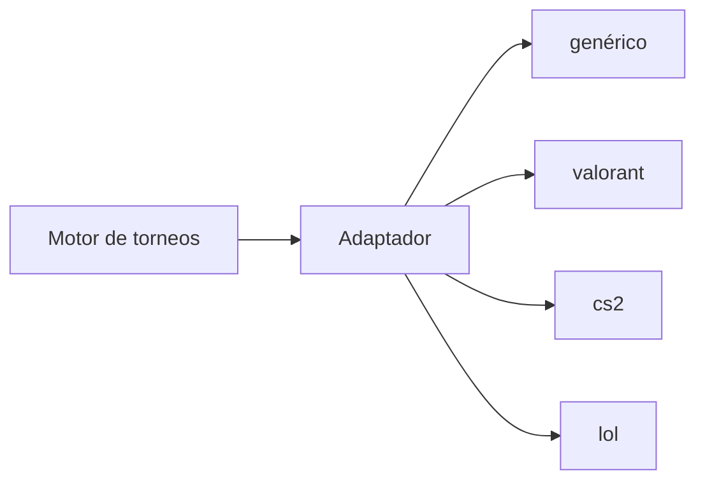

# Adaptadores de juegos

## 1. Concepto

Los adaptadores definen las reglas de un videojuego para el motor. El núcleo de torneos es agnóstico del juego (ADR-024): un adaptador es **configuración tipada** con validación, sin integraciones externas en el MVP.



## 2. Interfaz del adaptador

```ts
interface GameAdapterConfig {
  key: string;                 // "valorant"
  name: string;                // "Valorant"
  iconUrl?: string;
  platforms: Platform[];       // ["pc", ...]
  team: {
    minPlayers: number;        // 5
    maxPlayers: number;        // 5
    substitutes: number;       // 1-2
  };
  playerId: {
    label: string;             // "Riot ID"
    format: RegExp;            // /^[^#]+#[A-Z0-9]{3,5}$/i
    hint: string;              // "Nombre#TAG"
  };
  regions?: string[];
  maps?: string[];             // nombres canónicos
  modes?: string[];
  scoring: {
    type: "series" | "first_to" | "timed";
    drawAllowed: boolean;
    defaultSeries?: number[];  // [1, 3, 5]
  };
  matchFormats: {
    series: boolean;           // BO1/BO3/BO5
    timed: boolean;
  };
  veto: {
    mode: "external";          // MVP: fuera de plataforma + registro
    mapsRequired: boolean;
  };
  customFields?: FieldSchema[]; // campos propios de inscripción
  integrations?: string[];      // ["riot-api", ...] futuro; vacío en MVP
}
```

La validación en tiempo de ejecución usa zod (`packages/validation`) y comparte tipos con `packages/shared-types`.

## 3. Adaptador genérico

- Cualquier juego sin adaptador oficial.
- Config por defecto: equipo 1–10 jugadores, 0–2 suplentes, BO1/BO3/BO5, empates permitidos según el organizador, sin mapas ni regiones.
- El organizador personaliza campos y tamaños al crear el torneo.

## 4. Adaptadores oficiales del MVP

| Juego | Tamaño equipo | Suplentes | ID de jugador | Mapas | Empate | Formato |
| --- | --- | --- | --- | --- | --- | --- |
| Valorant | 5 | 1 | Riot ID (`Nombre#TAG`) | Ascendant, Bind, Breeze, Haven, Icebox, Lotus, Pearl, Split, Sunset | No | BO1/BO3/BO5 |
| CS2 | 5 | 1 | SteamID64 | Anubis, Dust2, Inferno, Mirage, Nuke, Overpass, Ancient, Vertigo | No | BO1/BO3/BO5 |
| LoL | 5 | 1 | Invocador + región | Summoner's Rift (mapa único) | No | BO1/BO3/BO5 |

Notas:
- Los valores de mapas pueden cambiar con parches; se mantienen en configuración versionada del adaptador.
- El empate se declara por adaptador (`drawAllowed: false` en estos tres).
- Los campos de ID se validan en inscripción y en el perfil público.

## 5. Ciclo de vida de un adaptador

1. **Propuesta:** issue con la plantilla `game_adapter_proposal.md`.
2. **Evaluación:** coherencia con el modelo, mantenibilidad y comunidad.
3. **Implementación:** configuración tipada + validación + tests de ejemplo.
4. **Publicación:** se versiona en `packages/game-adapters` y se documenta.

## 6. Testing de adaptadores

- Tests de esquema: la configuración valida contra el contrato.
- Tests de ejemplo: un torneo de ejemplo por juego genera brackets y acepta resultados correctos.
- Tests negativos: rosters inválidos, IDs mal formados, empates en juegos sin empates.

## 7. Futuro

- Integraciones externas (Riot, Steam) para verificación de resultados.
- Veto interactivo con mapas del adaptador.
- Adaptadores comunitarios a través del proceso de propuesta.
