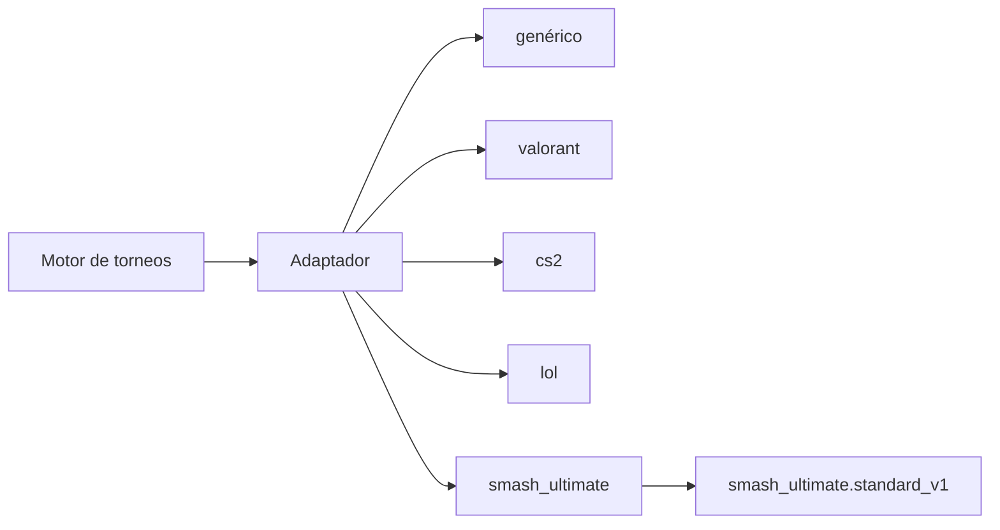

# Adaptadores de juegos

## 1. Concepto

Los adaptadores definen las reglas de un videojuego para el motor. El núcleo de torneos es agnóstico del juego (ADR-024): un adaptador es **configuración tipada** con validación, sin integraciones externas en el MVP.



## 2. Interfaz del adaptador

```ts
interface GameAdapterConfig {
  key: string; // "valorant"
  name: string; // "Valorant"
  iconUrl?: string;
  platforms: Platform[]; // ["pc", ...]
  team: {
    minPlayers: number; // 5
    maxPlayers: number; // 5
    substitutes: number; // 1-2
  };
  playerId: {
    label: string; // "Riot ID"
    format: RegExp; // /^[^#]+#[A-Z0-9]{3,5}$/i
    hint: string; // "Nombre#TAG"
  };
  regions?: string[];
  maps?: string[]; // nombres canónicos
  modes?: string[];
  scoring: {
    type: 'series' | 'first_to' | 'timed';
    drawAllowed: boolean;
    defaultSeries?: number[]; // [1, 3, 5]
  };
  matchFormats: {
    series: boolean; // BO1/BO3/BO5
    timed: boolean;
  };
  veto: {
    mode: 'external'; // MVP: fuera de plataforma + registro
    mapsRequired: boolean;
  };
  terminology?: {
    participantSingular: string;
    participantPlural: string;
    teamSingular: string;
    teamPlural: string;
  };
  tournamentTemplate?: {
    key: string;
    version: number;
    editable: boolean;
    defaults: TournamentTemplateDefaults;
  };
  customFields?: FieldSchema[]; // campos propios de inscripción
  integrations?: string[]; // ["riot-api", ...] futuro; vacío en MVP
}
```

La validación en tiempo de ejecución usa zod (`packages/validation`) y comparte tipos con `packages/shared-types`.

## 3. Adaptador genérico

- Cualquier juego sin adaptador oficial.
- Config por defecto: equipo 1–10 jugadores, 0–2 suplentes, BO1/BO3/BO5, empates permitidos según el organizador, sin mapas ni regiones.
- El organizador personaliza campos y tamaños al crear el torneo.

Una **plantilla de torneo** es opcional y vive dentro de un adaptador. A diferencia del adaptador, que define identidad, roster y capacidades del juego, la plantilla aplica valores iniciales coherentes para formato, capacidad, series, check-in y reglas específicas. El servidor vuelve a validar esos invariantes; no confía solo en el formulario web.

## 4. Adaptadores oficiales del MVP

| Juego                      | Tamaño equipo | Suplentes | ID de jugador          | Mapas o escenarios                                                                               | Empate | Formato                                |
| -------------------------- | ------------- | --------- | ---------------------- | ------------------------------------------------------------------------------------------------ | ------ | -------------------------------------- |
| Valorant                   | 5             | 1         | Riot ID (`Nombre#TAG`) | Abyss, Ascent, Bind, Breeze, Haven, Icebox, Lotus, Pearl, Split, Sunset                          | No     | BO1/BO3/BO5                            |
| CS2                        | 5             | 1         | SteamID64              | Ancient, Anubis, Dust2, Inferno, Mirage, Nuke, Overpass, Train, Vertigo                          | No     | BO1/BO3/BO5                            |
| LoL                        | 5             | 1         | Invocador + región     | Summoner's Rift (mapa único)                                                                     | No     | BO1/BO3/BO5                            |
| Super Smash Bros. Ultimate | 1             | 0         | Tag de bracket         | Battlefield, Small Battlefield, Pokémon Stadium 2, Final Destination, Town & City + counterpicks | No     | BO3/BO5; doble eliminación por defecto |

Notas:

- Los valores de mapas pueden cambiar con parches; se mantienen en configuración versionada del adaptador.
- El empate se declara por adaptador (`drawAllowed: false` en los cuatro adaptadores oficiales).
- Los campos de ID se validan en inscripción y en el perfil público.
- La plantilla `smash_ultimate.standard_v1` parte de 3 stocks, 7 minutos, objetos y hazards desactivados, 3 bans, gran final con reset y capacidad 32. El organizador puede editarla o restaurar sus valores estándar.

### Reporte estructurado de sets de Smash

El endpoint `POST /matches/:matchId/results` admite un campo opcional `games` para Smash Ultimate. Cada entrada registra número de game, escenario, personaje de cada participante, ganador y stocks restantes. El servidor valida el orden, el BO, el límite de stocks, los participantes, el pool de escenarios y la coherencia con el marcador global.

En la web, los capitanes usan un formulario guiado compatible con BO3/BO5 para elegir marcador, escenario, personajes, ganador y stocks de cada game. El formulario construye el contrato estructurado y lleva el foco al primer campo incompleto. Los reportes heredados sin `games` siguen siendo compatibles; cuando ambos capitanes incluyen el detalle, éste también debe coincidir para confirmar automáticamente el resultado. El detalle confirmado queda dentro del JSONB `matches.result` y se publica mediante el bracket API. Otros adaptadores conservan el formulario genérico y rechazan este campo específico.

Esta capacidad registra lo ocurrido; todavía no implementa el veto interactivo ni aplica DSR durante la selección de escenario.

## 5. Ciclo de vida de un adaptador

1. **Propuesta:** issue con la plantilla `game_adapter_proposal.md`.
2. **Evaluación:** coherencia con el modelo, mantenibilidad y comunidad.
3. **Implementación:** configuración tipada + validación + tests de ejemplo.
4. **Publicación:** se versiona en `packages/game-adapters` y se documenta.

## 6. Testing de adaptadores

- Tests de esquema: la configuración valida contra el contrato.
- Tests de ejemplo: un torneo de ejemplo por juego genera brackets y acepta resultados correctos.
- Tests negativos: rosters inválidos, IDs mal formados, empates en juegos sin empates.
- Tests de plantilla: los defaults, el merge en servidor y las reglas específicas mantienen sus invariantes.
- Tests de resultados: el detalle por game respeta participantes, BO, stocks, escenarios y marcador global.

## 7. Futuro

- Integraciones externas (Riot, Steam) para verificación de resultados.
- Veto interactivo con mapas del adaptador.
- Adaptadores comunitarios a través del proceso de propuesta.
