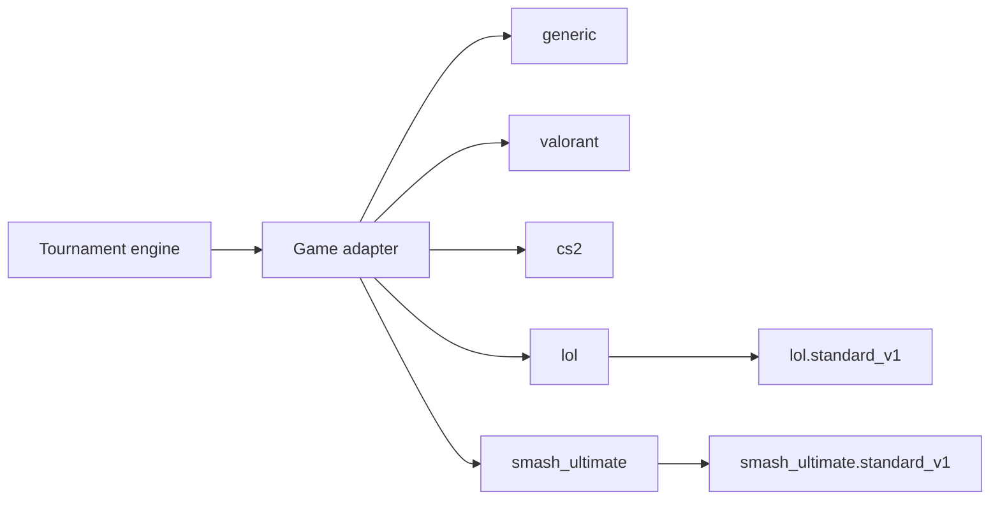

# Game adapters

## Concept

Game adapters describe a video game to the tournament engine. The tournament core remains game-agnostic (ADR-024): an adapter is **typed configuration with validation**, not an external game API integration.



## Adapter contract

```ts
interface GameAdapterConfig {
  key: string;
  name: string;
  iconUrl?: string;
  platforms: Platform[];
  team: {
    minPlayers: number;
    maxPlayers: number;
    substitutes: number;
  };
  playerId: {
    label: string;
    format: RegExp;
    hint: string;
  };
  regions?: string[];
  maps?: string[];
  modes?: string[];
  scoring: {
    type: 'series' | 'first_to' | 'timed';
    drawAllowed: boolean;
    defaultSeries?: number[];
  };
  matchFormats: {
    series: boolean;
    timed: boolean;
  };
  veto: {
    mode: 'external';
    mapsRequired: boolean;
  };
  terminology?: {
    participantSingular: string;
    participantPlural: string;
    teamSingular: string;
    teamPlural: string;
  };
  tournamentTemplate?: {
    key: string;
    version: number;
    editable: boolean;
    defaults: TournamentTemplateDefaults;
  };
  customFields?: FieldSchema[];
  integrations?: string[];
}
```

Runtime validation uses Zod in `packages/validation`; shared TypeScript contracts live in `packages/shared-types`.

## Generic adapter

The generic adapter supports games without an official adapter. It defaults to teams of 1–10 players, 0–2 substitutes, BO1/BO3/BO5 series, organizer-controlled draws, and no predefined maps or regions. Organizers customize team sizes and fields while creating a tournament.

A **tournament template** is optional and belongs to an adapter. The adapter defines game identity, roster constraints, and capabilities. A template provides coherent initial values for format, capacity, series, check-in, and game-specific rules. The API validates template invariants again and never trusts only the web form.

## Official adapters

| Game                       | Team size | Substitutes | Player ID           | Maps or stages                          | Draw | Format                                 |
| -------------------------- | --------: | ----------: | ------------------- | --------------------------------------- | ---- | -------------------------------------- |
| Valorant                   |         5 |           1 | Riot ID, `Name#TAG` | Current competitive map pool            | No   | BO1/BO3/BO5                            |
| Counter-Strike 2           |         5 |           1 | SteamID64           | Current competitive map pool            | No   | BO1/BO3/BO5                            |
| League of Legends          |         5 |           1 | Riot ID, `Name#TAG` | Summoner’s Rift                         | No   | BO1/BO3/BO5                            |
| Super Smash Bros. Ultimate |         1 |           0 | Bracket tag         | Versioned starter and counterpick pools | No   | BO3/BO5; double elimination by default |

Map and stage pools change with patches and are versioned in adapter configuration. Player identifiers are validated at registration and in profiles.

### Smash Ultimate template

`smash_ultimate.standard_v1` starts with:

- 3 stocks and a 7-minute limit.
- Items, Final Smash Meter, and stage hazards disabled.
- A versioned starter and counterpick pool.
- 3 stage bans with editable DSR policy.
- BO3, double elimination, 32-player capacity, and a grand-final reset.

Organizers may edit the values or restore the standard template. The API validates stock limits, time, unique stages, bans, launch rate, and the relationship between stage pools.

### League of Legends template

`lol.standard_v1` starts with 16 teams, single elimination, BO3, LAN, Summoner’s Rift, and Tournament Draft. It does not pin a patch so the template cannot become stale. Organizers can select the live patch or record a fixed version, enable Fearless Draft, set side-selection policy, and adjust pause allowance and spectator delay.

## Structured League of Legends reports

`POST /matches/:matchId/results` accepts an optional `lolGames` field for LoL. Each entry records the game number, winner, blue-side team, duration, and optional Riot Match ID. The API checks order, best-of limits, participants, duplicate identifiers, and consistency with the aggregate score.

The web application offers valid final scores for BO1, BO3, and BO5 and creates the exact number of game rows required. Bilateral reporting still applies: both teams must submit matching details for automatic confirmation. Legacy reports without `lolGames` remain valid.

A Riot Match ID improves traceability but is optional. The template does not require a Riot API key or external connectivity. A future Tournament Codes integration may automate lobbies and results without changing the manual contract. References: [Riot Tournament API](https://developer.riotgames.com/docs/lol) and the [official competitive operations library](https://competitiveops.riotgames.com/en-US/library?game=lol).

## Structured Smash reports

The same result endpoint accepts an optional `games` field for Smash Ultimate. Each game records its number, stage, both characters, winner, and remaining stocks. The API checks order, best-of limits, stock limits, participants, stage pools, and aggregate-score consistency.

The web form supports BO3 and BO5, generates the exact game count from the selected score, and focuses the first incomplete field. Bilateral reports must match in both the aggregate and structured detail. Legacy reports without `games` remain compatible. Confirmed details are stored in `matches.result` JSONB and exposed by the bracket API.

This feature records what happened. It does not yet provide an interactive stage-veto flow or enforce DSR while selecting a stage.

## Adapter lifecycle

1. **Proposal:** open an issue with `.github/ISSUE_TEMPLATE/game_adapter_proposal.md`.
2. **Evaluation:** maintainers review model fit, sources, maintenance, and community demand.
3. **Implementation:** add typed configuration, validation, documentation, and representative tests.
4. **Publication:** version the adapter in `packages/game-adapters`.

## Required tests

- Schema tests prove that configuration satisfies the contract.
- Representative tournament tests generate brackets and accept valid results.
- Negative tests reject invalid rosters, malformed identifiers, and disallowed draws.
- Template tests protect defaults, server-side merging, and game-specific invariants.
- Result tests prove that per-game detail matches participants, best-of rules, game rules, and the aggregate score.

## Future extensions

- Authorized Riot or Steam integrations for result verification.
- Interactive map and stage vetoes.
- Community adapters through the documented proposal process.
