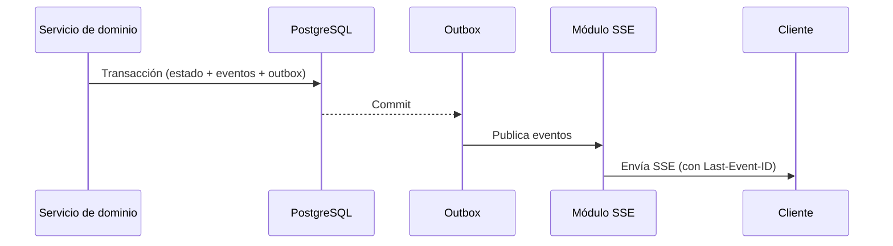

# Arquitectura de tiempo real

## 1. Elección: SSE

El MVP usa **Server-Sent Events** (ADR-033): las actualizaciones son mayoritariamente unidireccionales (servidor → cliente), SSE corre sobre HTTP, se reconecta automáticamente y no requiere infraestructura adicional.

No se usan WebSockets en el MVP. Si en fases posteriores se incorpora chat interno o veto interactivo bidireccional, se evalúa Socket.IO/WebSocket sin cambiar el modelo de eventos de dominio.

## 2. Endpoints

- `GET /api/v1/events` — autenticado; recibe eventos de los canales suscritos (`user:<id>`, `org:<id>`, `tournament:<id>`).
- `GET /api/v1/events/public?tournament=<id>` — sin sesión; solo eventos públicos del torneo.

## 3. Formato de eventos

```text
id: 019f1a2b-... 
event: match.updated
data: {"tournamentId":"...","matchId":"...","status":"finalized","result":{...}}
retry: 3000
```

Tipos:

| Evento | Público | Privado |
| --- | --- | --- |
| `tournament.updated` | Sí | |
| `bracket.updated` | Sí | |
| `match.updated` | Sí | |
| `result.confirmed` | Sí | |
| `dispute.updated` | No | staff y partes |
| `notification.created` | No | usuario |
| `checkin.status` | No | staff y capitán |

## 4. Flujo de publicación



- El outbox garantiza entrega eventual: si el proceso cae tras el commit, un job reenvía eventos pendientes.
- En MVP monoproceso, la publicación es en memoria; la tabla de outbox permite recuperación y futura escala multi-nodo (Redis pub/sub documentado como evolución).

## 5. Suscripciones y autorización

- El cliente se suscribe a canales según sus roles (resueltos en backend).
- Eventos privados nunca se envían a canales públicos.
- Al conectar, el servidor envía un snapshot del estado relevante (bracket actual) y luego los eventos.
- Reconexión: `Last-Event-ID` → se reenvían eventos perdidos desde la cola corta; si se perdió demasiado, se recarga el snapshot.

## 6. Conexión y recursos

- Un cliente mantiene una conexión SSE por pestaña; el servidor identifica la pestaña con `clientId`.
- Timeout de inactividad: keep-alive cada 15 s (`: ping`).
- Límite de conexiones por usuario (defecto 5) y por IP (rate limiting).
- Al cerrar sesión, se cierran los canales privados.

## 7. PWA

- Con la app abierta, SSE actualiza la UI.
- Sin notificaciones push ni actualización en segundo plano en el MVP (fase 6).
- La caché de lectura (bracket/reglas/resultados) se refresca en cada carga y con eventos recibidos.

## 8. Pruebas

- Integración: emitir un evento de dominio y verificar la entrega a clientes suscritos.
- Reconexión: cortar y verificar recuperación con `Last-Event-ID`.
- Autorización: un visitante no recibe eventos privados.
- Carga: 256 conexiones simuladas sin pérdida significativa (p95 < 1 s).
