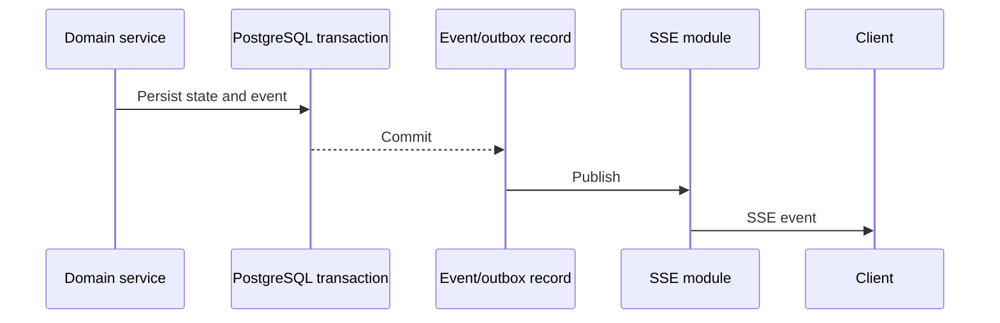

# Real-time architecture

## Choice: Server-Sent Events

OpenTournament uses SSE because current updates are primarily server-to-client. SSE runs over HTTP, reconnects in browsers, and avoids another service. WebSockets remain an option only for future bidirectional features such as chat or interactive vetoes.

## Endpoints

- `GET /api/v1/events`: authenticated actor channels.
- `GET /api/v1/events/public?tournament=<id>`: public tournament events.

## Event format

```text
id: 019f1a2b-...
event: match.updated
data: {"tournamentId":"...","matchId":"...","status":"finalized","result":{...}}
retry: 3000
```

| Event                  | Public | Private audience               |
| ---------------------- | ------ | ------------------------------ |
| `tournament.updated`   | Yes    | —                              |
| `bracket.updated`      | Yes    | —                              |
| `match.updated`        | Yes    | —                              |
| `result.confirmed`     | Yes    | —                              |
| `dispute.updated`      | No     | Staff and parties              |
| `notification.created` | No     | One user                       |
| `checkin.status`       | No     | Staff and eligible participant |

## Publication flow



Domain state must commit before a client observes the event. When durable outbox delivery is used, a worker can retry publication after process failure.

## Authorization and reconnect

- The API derives private channels from the authenticated actor; clients do not grant themselves a channel.
- Public channels contain no dispute, evidence, pass, or private participant data.
- Clients refresh the authoritative resource after reconnect.
- `Last-Event-ID` may recover a short gap; a full resource fetch handles an unavailable history window.
- Logout closes or invalidates private streams.

## Client behavior

- Use one connection per page context.
- Show connecting, live, and reconnecting states honestly.
- Keep-alive comments may prevent idle proxy termination.
- SSE events invalidate/refetch state; they should not become a second independent state store.
- Announce only meaningful live changes to assistive technology.

## PWA behavior

SSE updates the app while open. The service worker stores read-only public resources and refreshes them on later loads. Background push and offline mutations are outside the MVP.

## Verification

- Deliver an event to an eligible subscriber.
- Prevent a visitor or unrelated organization actor from receiving private events.
- Reconnect and restore authoritative state.
- Simulate 256 public connections and measure propagation.
- Verify screen-reader announcements do not repeat noisy connection heartbeats.
