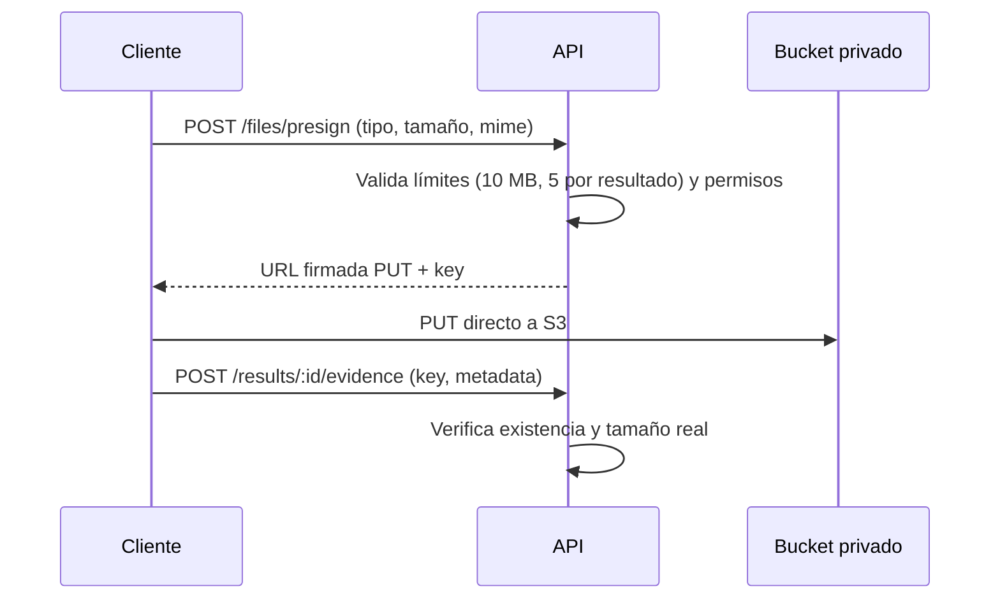

# Estrategia de almacenamiento

## 1. Elección: S3-compatible

OpenTournament usa una abstracción S3 para todos los archivos (ADR-032):

- **Desarrollo:** MinIO en Docker Compose.
- **Producción:** Cloudflare R2, AWS S3 o cualquier S3-compatible (MinIO autoalojado).

Un solo contrato (`PutObject`, `GetObject`, `DeleteObject`, presign) mantenido en `packages/database` o un helper de storage; nunca se dependa de un proveedor específico.

## 2. Buckets

| Bucket | Contenido | Acceso |
| --- | --- | --- |
| `opentournament-public` | logos, avatares, íconos | Lectura pública, escritura vía presign autenticado |
| `opentournament-private` | evidencias | Privado; acceso solo vía URLs firmadas con expiración corta |

Alternativa más simple soportada: un solo bucket con prefijos `public/` y `private/` (configurable por variable de entorno).

## 3. Flujo de subida (evidencias)

Reglas:
- El cliente sube directo a S3 con URL firmada (sin pasar el binario por la API).
- Se verifican el tamaño real y el tipo MIME tras la subida (magic bytes).
- Extensiones/MIME permitidos: `image/png`, `image/jpeg`, `image/webp`, `image/gif`.
- Sin contenido ejecutable; se sirve con `Content-Disposition: attachment` cuando corresponda.

## 4. Descarga y URLs firmadas

- Evidencias: URL firmada con expiración de 15 minutos (configurable).
- La URL firmada se genera solo para usuarios con `evidence.view` y alcance (staff/árbitro/partes).
- Logos/avatares: URL pública estable; se cachea en CDN si se configura.

## 5. Límites

| Parámetro | Valor |
| --- | --- |
| Máx. por archivo (evidencia) | 10 MB |
| Máx. por resultado | 5 archivos |
| Máx. avatar/logo | 2 MB |
| Tipos permitidos | PNG, JPEG, WebP, GIF |

## 6. Retención y limpieza

- Las evidencias no se eliminan al resolver una disputa; quedan para auditoría.
- Política de retención configurable por instancia (defecto: 1 año tras finalizar el torneo).
- Jobs de limpieza: borrar evidencias huérfanas (sin referencia) y expiradas según retención.
- Los objetos borrados por retención no son recuperables (documentar en la política de la instancia).

## 7. Seguridad

- Bucket privado por defecto; nunca público.
- Presign con expiración corta y permiso mínimo (`PutObject` solo al key generado).
- Validación de MIME y tamaño posterior a la subida.
- Sin SSRF: los enlaces externos de evidencia no se descargan ni se procesan en el MVP.
- Escaneo antivirus: diferido (se documenta en riesgos); mitigación inicial por tipo de archivo y tamaño.

## 8. Backup

- El bucket debe incluirse en la política de respaldo de la instancia (documentado en [SELF_HOSTING.md](SELF_HOSTING.md)).
