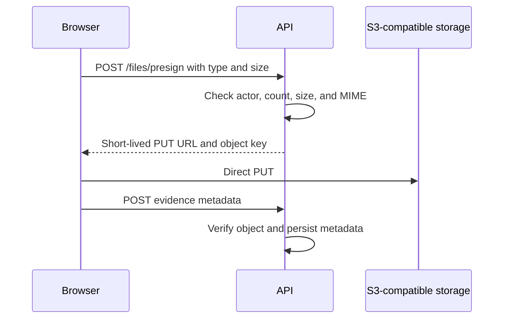

# Storage strategy

## S3-compatible boundary

OpenTournament uses one S3-compatible contract for object storage:

- MinIO in local and default Compose environments.
- Cloudflare R2, Amazon S3, or compatible operator-managed storage in production.

Provider-specific behavior must stay behind the storage service. Domain and route code work with object keys and presigned operations.

## Bucket layout

An instance may use separate public/private buckets or one bucket with prefixes:

| Prefix or bucket | Content           | Access                           |
| ---------------- | ----------------- | -------------------------------- |
| `public/`        | Logos and avatars | Public read, authenticated write |
| `private/`       | Result evidence   | Private, authorized signed read  |

The current environment variables define the bucket and endpoint; contributors must verify the implementation before introducing a second physical bucket.

## Evidence upload

The browser uploads directly to storage. The API records metadata only after verifying authorization and object expectations.

## Constraints

| Parameter          | Default limit        |
| ------------------ | -------------------- |
| Evidence object    | 10 MB                |
| Objects per result | Five                 |
| Avatar or logo     | 2 MB                 |
| Image types        | PNG, JPEG, WebP, GIF |

Never accept executable content. Serve private downloads with safe content headers.

## Signed reads

- Generate a signed URL only after `evidence.view` and resource-scope checks.
- Keep expiration short; 15 minutes is the intended default.
- Do not expose the underlying private key in a public API response.
- Public media may use stable cacheable URLs.

## Retention

- Resolving a dispute does not immediately remove its evidence.
- Instance operators define retention; one year after tournament finalization is the suggested default.
- Cleanup jobs remove orphaned uploads and retention-expired objects.
- Deletion under retention is irreversible unless operator backups contain the object.

## Security

- Private evidence is never public by default.
- Presigned PUT access is limited to one generated key and short expiration.
- Validate declared and observed type/size.
- Do not download or process external evidence links, avoiding SSRF.
- Antivirus scanning is a future defense-in-depth option.

## Backup

Include object storage in the same tested recovery plan as PostgreSQL. See [SELF_HOSTING.md](SELF_HOSTING.md).
