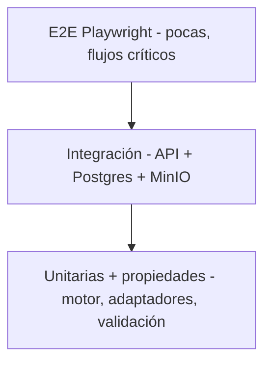

# Estrategia de pruebas

## 1. Pirámide

- **Unitarias (Vitest):** motor de torneos, adaptadores, validación, permisos, utilidades.
- **Integración (Vitest + contenedores):** API contra PostgreSQL y MinIO reales (compose de test).
- **E2E (Playwright):** flujos completos de usuario en navegador.
- **Calidad:** cobertura del motor ≥ 95%; API ≥ 80% de líneas críticas; lint + typecheck + build en CI.

## 2. Tests del motor

- Por comando y transición de estado.
- De propiedades: N participantes (2, 3, 5, 8, 16, 33, 64, 128) → bracket completo, sin huérfanos, ganador único.
- Escenarios: BYEs, seeds, empates, walkover, DQ, anulación, doble eliminación con/sin reset, disputas, reportes concurrentes, idempotencia.

Ver [TOURNAMENT_ENGINE.md](TOURNAMENT_ENGINE.md) §9.

## 3. Tests de integración

- Autenticación: registro, login, Discord OAuth (mock), recuperación, sesión/CSRF.
- Autorización: IDOR entre organizaciones, escalamiento de roles, acceso a evidencias y disputas.
- Flujo de torneo: crear → inscribir → check-in → bracket → partida → resultado → confirmación.
- Concurrencia: reportes simultáneos del mismo resultado; escrituras con versionado.
- Jobs: cierre de check-in, walkover, timeouts, notificaciones (outbox).
- Storage: presign, subida real a MinIO, validación de tamaño/MIME, URLs firmadas.
- SSE: entrega a suscriptores, reconexión con `Last-Event-ID`, aislamiento de canales privados.

## 4. E2E (Playwright)

Flujos críticos:

1. Onboarding → crear organización → crear torneo → publicar.
2. Inscribir equipos (con aprobación y lista de espera) → check-in → generar bracket.
3. Reporte bilateral coincidente → confirmación automática → avance del bracket.
4. Reporte conflictivo → disputa → mensajes → asignación de árbitro → resolución → bracket actualizado.
5. Walkover por ausencia y reprogramación por admin.
6. Página pública con SSE (bracket se actualiza en vivo).
7. PWA instalable y caché de lectura.

Accesibilidad: `@axe-core/playwright` en páginas clave.

## 5. Tests de seguridad

- Automatizados: IDOR, escalamiento, CSRF, subida maliciosa, rate limiting, cabeceras.
- Estáticos: `pnpm audit`, CodeQL.
- Manuales pre-release: sesión, cookies, rich text, URLs firmadas.
- OWASP ZAP: baseline pasivo manual contra una instalación aislada de Docker Compose.
- Pentest manual: previo a releases mayores o cambios sensibles de autenticación/autorización.

## 6. Carga y rendimiento

- Smoke de concurrencia: 256 participantes (reportes simultáneos, check-in masivo).
- Generación de bracket: 128 y 512 participantes < 1 s.
- SSE: 256 conexiones, p95 < 1 s de propagación.
- Herramienta: script de carga simple (k6 opcional) integrado en CI como job separado.

## 7. Datos de prueba

- Seeds de demostración: 2 organizaciones, torneo sencilla + doble, equipos con rosters válidos, partidas con resultados, una disputa resuelta.
- Fixtures tipados por adaptador (Valorant/CS2/LoL) para rosters y resultados.

## 8. CI

| Stage | Comando |
| --- | --- |
| Lint | `pnpm lint` |
| Typecheck | `pnpm typecheck` |
| Unit | `pnpm test` |
| Integración | `pnpm test:integration` (compose de test) |
| E2E | `pnpm test:e2e` (Playwright) |
| Build | `pnpm build` |
| Seguridad | `pnpm audit --prod` + CodeQL + baseline manual OWASP ZAP |
