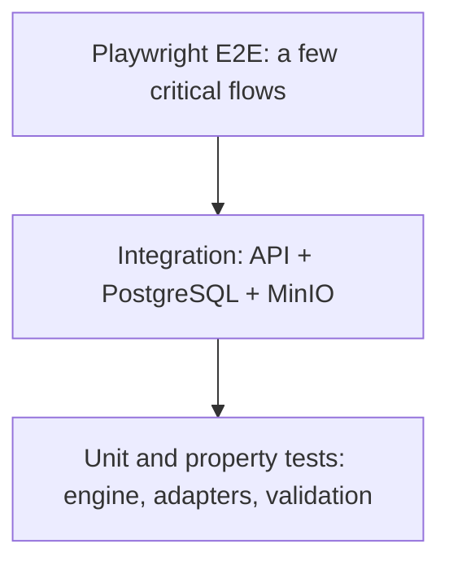

# Testing strategy

## Test pyramid



- **Unit tests (Vitest):** tournament engine, adapters, validation, permissions, and utilities.
- **Integration tests (Vitest + containers):** API behavior against real PostgreSQL and MinIO.
- **E2E tests (Playwright):** complete browser flows.
- **Quality gates:** at least 95% engine coverage, at least 80% of critical API lines, plus lint, type checking, tests, and build in CI.

## Engine tests

Cover every command and state transition. Property scenarios use participant counts such as 2, 3, 5, 8, 16, 33, 64, and 128 and assert a complete bracket, no orphaned entries, and one winner.

Required scenarios include BYEs, seeds, draws, walkovers, disqualifications, voided matches, double elimination with and without a grand-final reset, disputes, concurrent reports, and idempotency.

See [TOURNAMENT_ENGINE.md](TOURNAMENT_ENGINE.md).

## Integration tests

Run the complete API integration suite locally with:

```bash
pnpm test:integration
```

When `TEST_DATABASE_URL` is already configured, the command uses that database. Otherwise it starts an ephemeral `postgres:16-alpine` container on an automatically assigned loopback port, waits for readiness, runs the API suite, and removes the container. The temporary database never shares the development Compose volume.

- Authentication: registration, login, mocked Discord OAuth, recovery, sessions, and CSRF.
- Authorization: cross-organization IDOR, role escalation, evidence, and dispute access.
- Tournament flow: create, register, check in, seed, generate a bracket, play, report, and confirm.
- Concurrency: simultaneous reports for the same match and versioned writes.
- Jobs: check-in closure, walkovers, timeouts, notifications, and outbox dispatch.
- Storage: presigned URLs, real MinIO uploads, size and MIME checks, and signed downloads.
- SSE: delivery, `Last-Event-ID` reconnection, and private-channel isolation.

## E2E flows

1. Onboard, create an organization, create a tournament, and publish it.
2. Register teams with approval and waiting lists, check in, and generate a bracket.
3. Submit matching bilateral reports and advance the bracket automatically.
4. Submit conflicting reports, open a dispute, exchange messages, assign a referee, resolve it, and update the bracket.
5. Apply a walkover and reschedule a match as staff.
6. Observe a public bracket update through SSE.
7. Install the PWA and verify read caching.
8. Exercise the Spanish and English interfaces for user-facing changes.

Run `@axe-core/playwright` on key pages.

## Security tests

- Automated: IDOR, escalation, CSRF, malicious uploads, rate limiting, and security headers.
- Static: `pnpm audit` and CodeQL.
- Manual pre-release: sessions, cookies, rich text, signed URLs, and private participant passes.
- OWASP ZAP: manual passive baseline against an isolated Compose installation.
- Manual penetration test before major releases or sensitive authentication and authorization changes.

## Load and performance

- Concurrency smoke: 256 participants reporting or checking in.
- Bracket generation: 128 and 512 participants in under one second.
- SSE: 256 connections with propagation p95 under one second.
- A small load script or optional k6 job may run separately in CI.

## Test data

Demo seeds provide organizations, single- and double-elimination tournaments, valid rosters, completed matches, LoL and Smash structured reports, and a resolved dispute. Adapter-specific typed fixtures cover valid and invalid rosters and results.

## CI commands

| Gate                                  | Command                                                    |
| ------------------------------------- | ---------------------------------------------------------- |
| Lint                                  | `pnpm lint`                                                |
| Type checking                         | `pnpm typecheck`                                           |
| Unit and configured integration tests | `pnpm test`                                                |
| Isolated API integration tests        | `pnpm test:integration`                                    |
| E2E                                   | `pnpm test:e2e`                                            |
| Build                                 | `pnpm build`                                               |
| Security                              | `pnpm audit --prod`, CodeQL, and manual OWASP ZAP baseline |

A pull request should run the smallest focused test during development and the full relevant gate before review.
