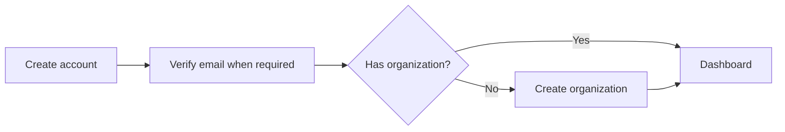
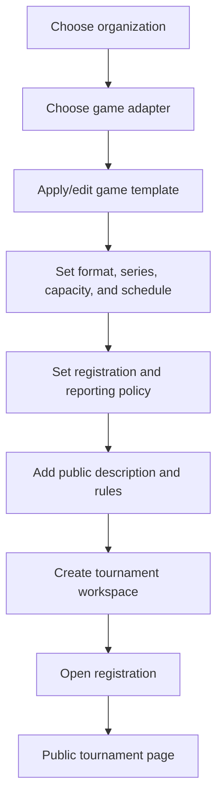
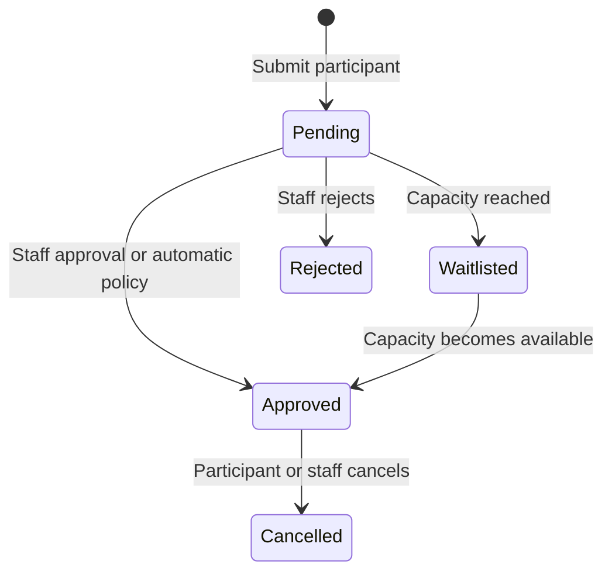
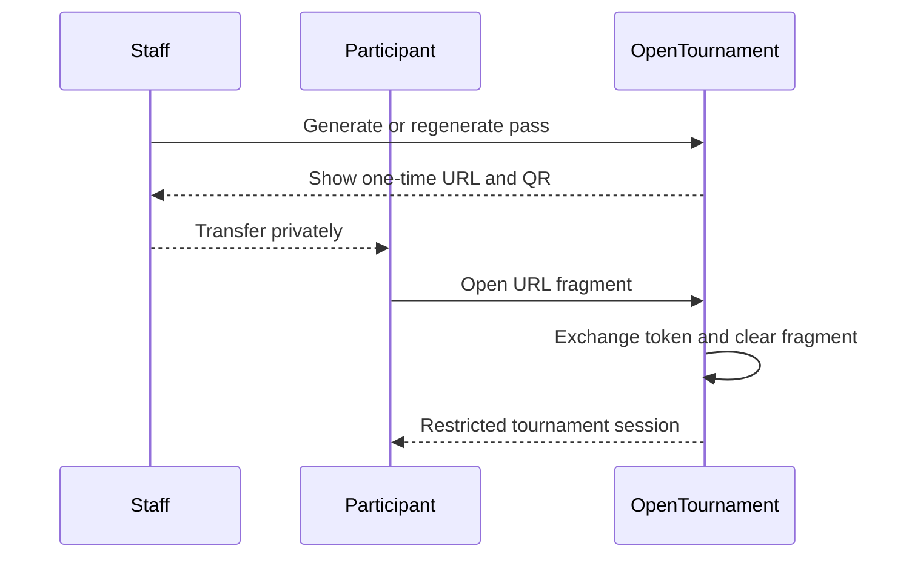
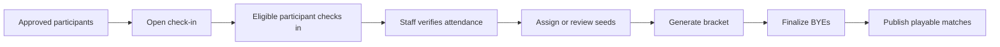
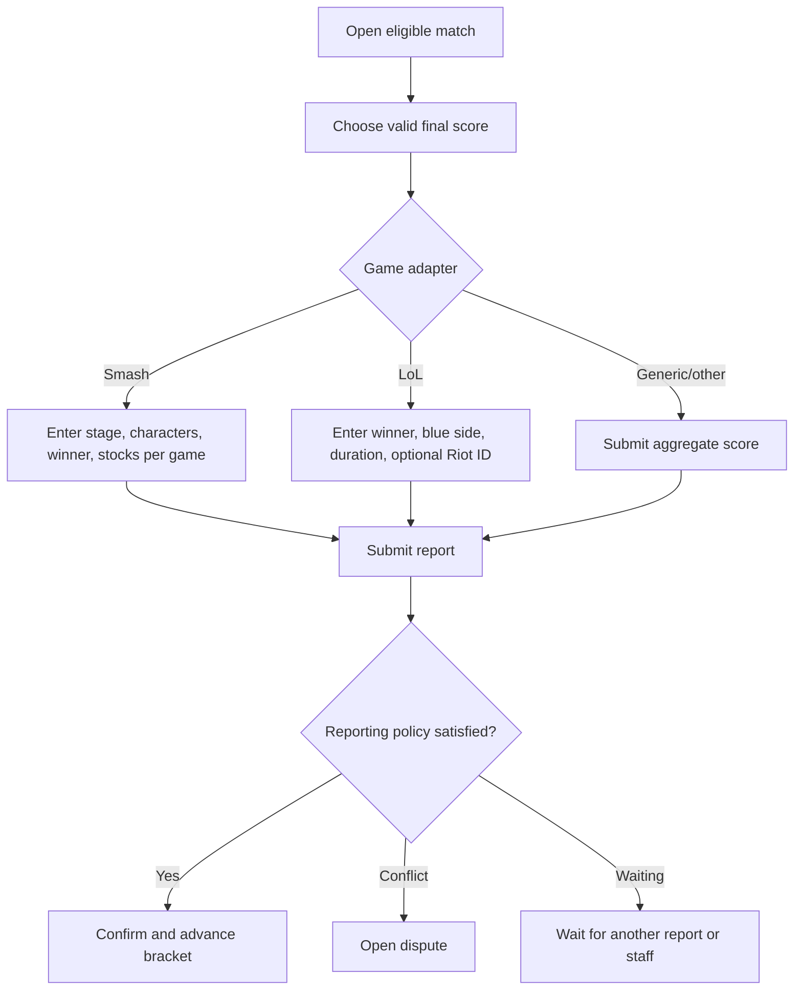
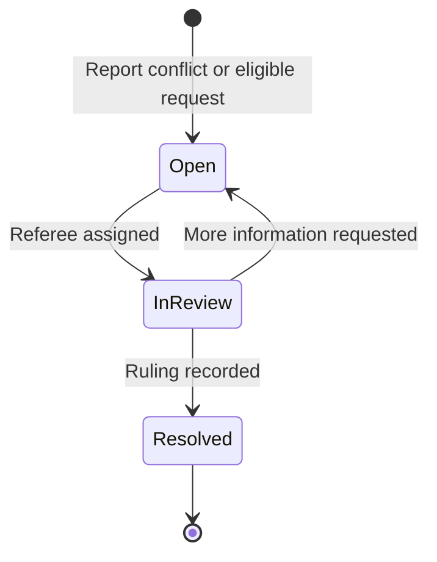
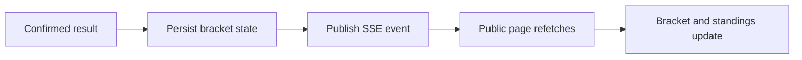

# User flows

These flows describe the intended user experience. Optional channels such as Discord appear only when configured. Detailed acceptance work lives in [BACKLOG.md](BACKLOG.md).

## Organizer onboarding

A first-time account creates its first organization. Existing users may belong to more than one organization.

## Create and publish a tournament

The adapter controls participant terminology and valid roster/result rules. Smash and LoL expose game-specific templates. Public pages are readable without an account.

## Register a participant

A team tournament validates the roster. An individual Smash entry uses a one-player participant. Approved participants may receive a private pass for restricted access.

## Participant-pass access

The token begins in the URL fragment so it is not sent in the initial HTTP request. Exchanging a pass replaces the current browser session and limits the actor to one tournament and participant.

## Check-in and bracket generation

Staff may generate only after the tournament has enough eligible participants. The engine determines BYEs and bracket destinations.

## Play and report a match

Bilateral mode requires matching eligible reports. Winner-only mode confirms one valid winner report. Staff-only mode prevents participant submission.

## Dispute and ruling

Staff and match parties may add messages according to authorization. A ruling records score/draw, rationale, actor, and considered evidence, then applies the authoritative result.

## Live public experience

The page shows honest connecting/live/reconnecting state. The PWA caches public read content but does not submit offline actions.

## Language and theme

- The browser language selects Spanish or English when no preference exists.
- The header selector persists an explicit language.
- System, light, and dark theme selection is independent of language.
- User-facing validations and statuses follow the selected locale.
- The document `lang` attribute matches rendered copy.

## Notification channels

| Event                           | In-app/SSE                    | Email                        | Discord         |
| ------------------------------- | ----------------------------- | ---------------------------- | --------------- |
| Registration or check-in window | Supported/planned by workflow | When SMTP and template exist | When configured |
| Match reminder                  | Planned durable job           | When SMTP exists             | When configured |
| Result confirmed                | Live tournament update        | Optional                     | When configured |
| Dispute update                  | Authorized actor update       | Optional                     | When configured |
| Final standings                 | Public update                 | Optional                     | When configured |

A channel must fail independently. Missing SMTP or Discord must never block the domain operation.
