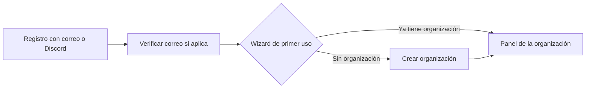
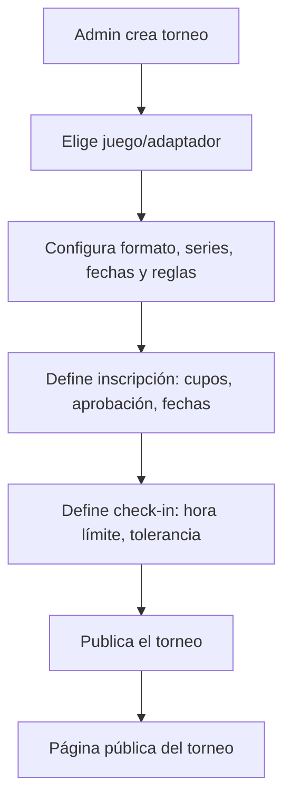
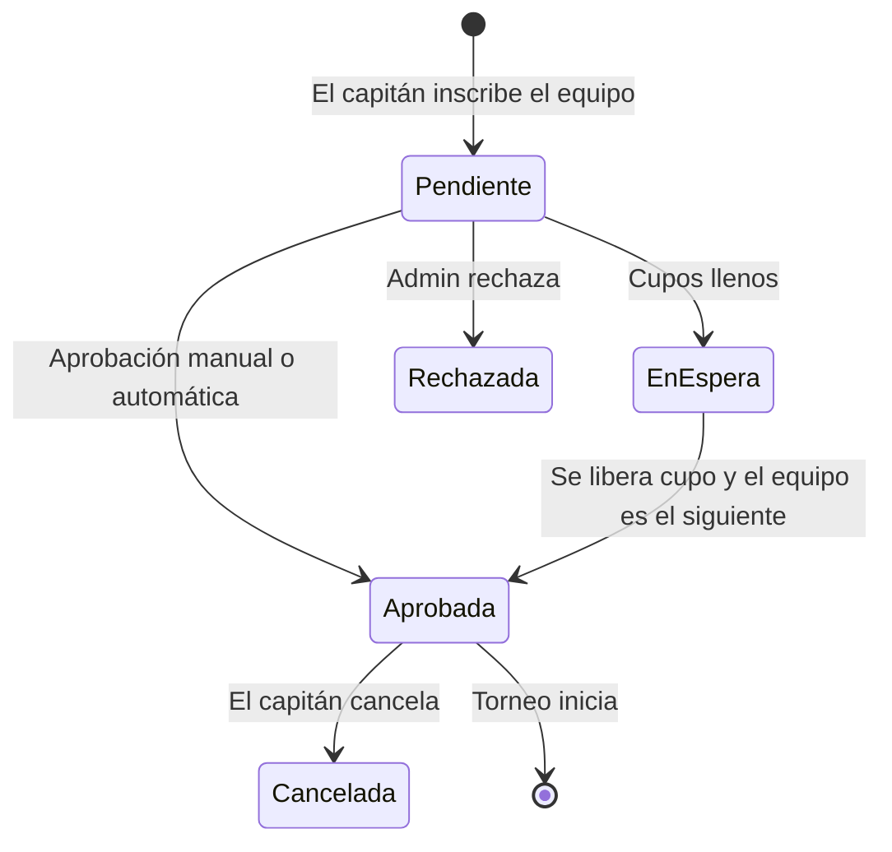
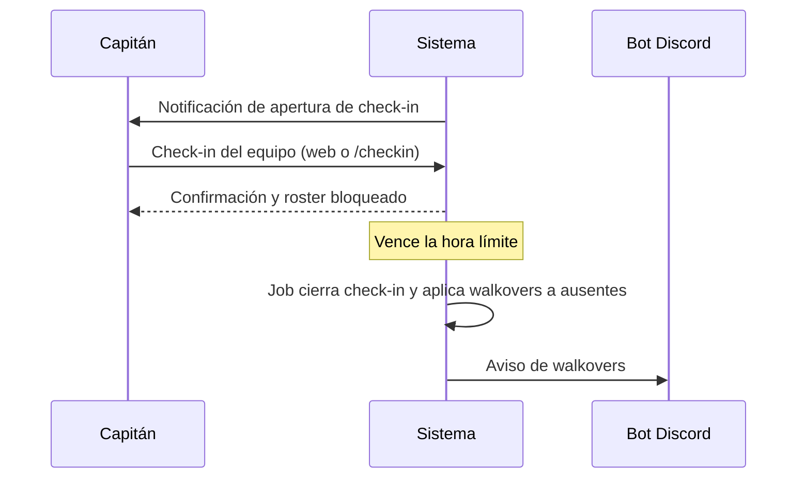
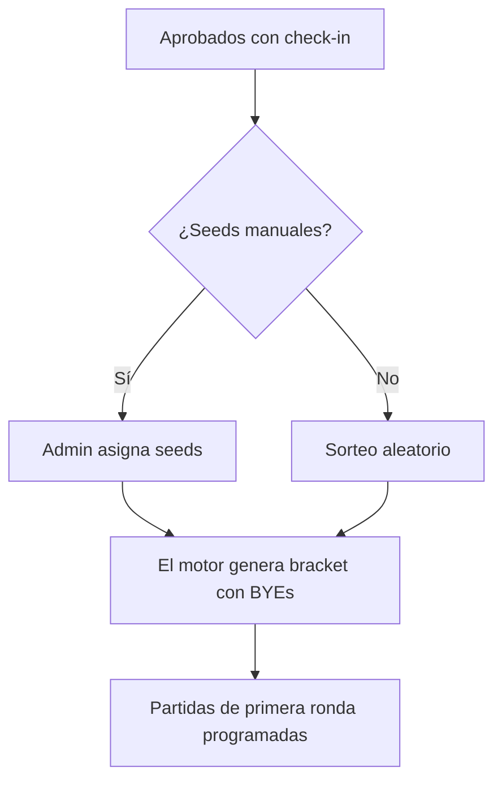
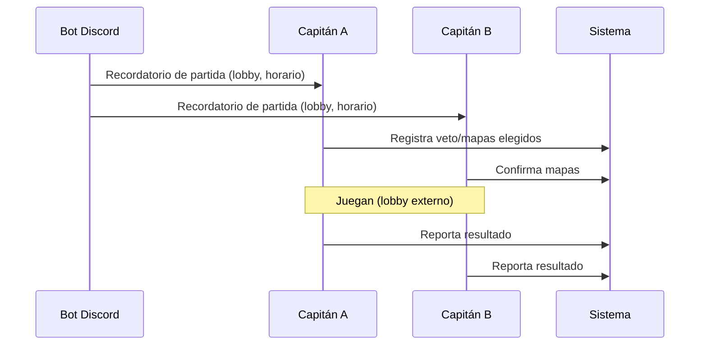
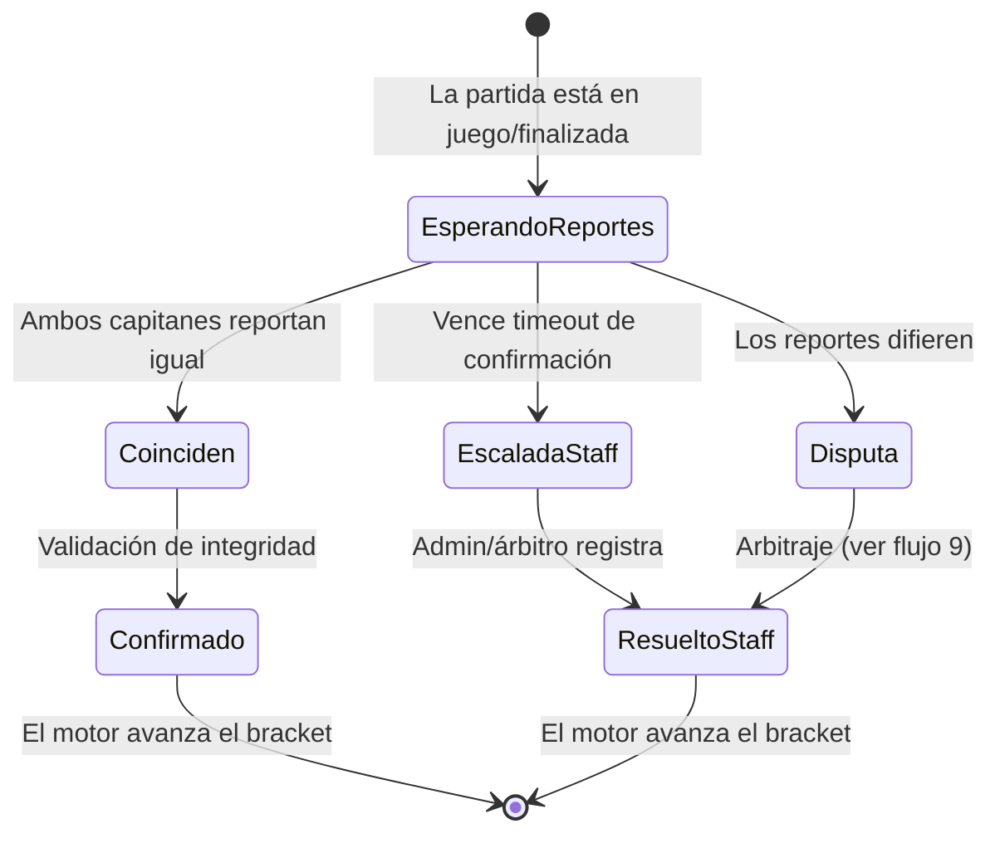
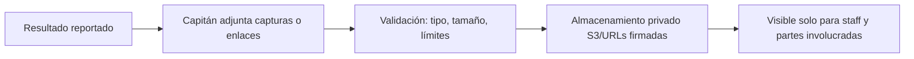
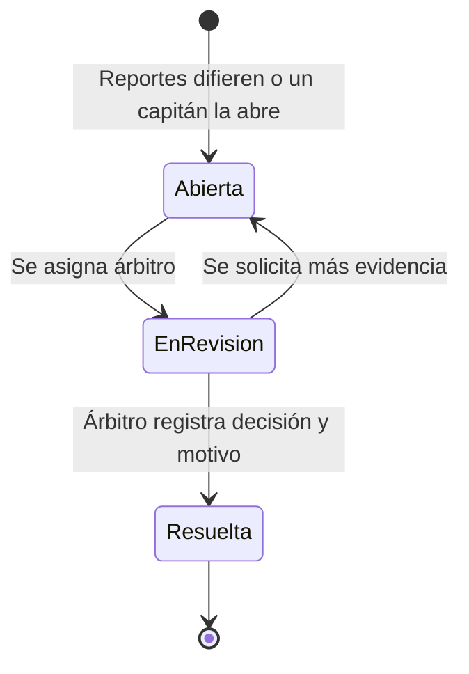
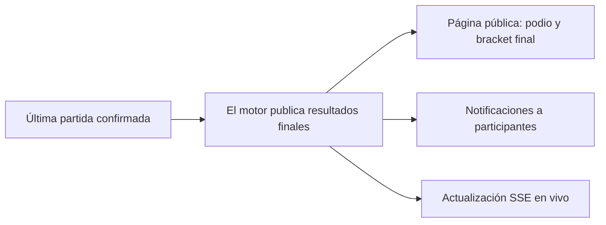

# Flujos de usuario

Este documento describe los flujos principales del MVP con diagramas Mermaid. Los flujos se implementan como historias en [docs/BACKLOG.md](BACKLOG.md).

## 1. Onboarding y creación de organización

- El primer usuario de una instancia ve el wizard que crea su primera organización (owner).
- Un usuario existente puede unirse a otra organización por invitación (correo) o crear una nueva si la instancia lo permite.

## 2. Creación de torneo

Puntos clave:
- El adaptador determina tamaño de equipo, suplentes e IDs de jugador requeridos.
- El torneo puede ser **público** (visible en la página de la organización y listado) o **no listado** (solo por URL).
- Las reglas se publican como parte de la página del torneo.

## 3. Inscripción de equipos

- El capitán crea un equipo nuevo (efímero) o selecciona uno permanente y completa el roster mínimo según el adaptador.
- Con inscripción automática, `Pendiente → Aprobada` ocurre al confirmar si hay cupo.
- La lista de espera es FIFO y se notifica por Discord/correo cuando un cupo se libera.
- Al alcanzar el cupo, las inscripciones nuevas pasan a `EnEspera`.

## 4. Check-in general

- El check-in se abre con la ventana configurada (defecto: 24 h antes, cierra 1 h antes).
- Al cerrarse, el roster queda bloqueado (AF-09).
- Los equipos ausentes pierden por walkover en la primera ronda; si quedan menos de 2 equipos válidos, el torneo se cancela (job de integridad).

## 5. Generación de brackets

- El motor asigna BYEs a los mejores seeds cuando el número de participantes no es potencia de 2.
- La generación es determinista dado el orden de seeds.
- El admin puede regenerar el bracket antes de la primera partida (corrección administrativa auditada).

## 6. Día de partida

- El campo `lobbyUrl` es opcional (modalidad presencial no lo usa).
- La tolerancia de retraso vence → walkover automático (job).
- El admin puede reprogramar la partida (con motivo registrado).

## 7. Reporte y confirmación de resultados

- Al confirmarse, el motor valida que el resultado sea consistente (sin dobles victorias, sin partidas duplicadas) y avanza el bracket automáticamente.
- El resultado confirmado es inmutable salvo corrección administrativa (anulación/reversión auditada).

## 8. Evidencias

- Las capturas se suben con URLs firmadas directamente al bucket privado.
- Los enlaces externos (YouTube/Twitch) se validan por formato de URL.
- Las evidencias no se eliminan al resolver la disputa; quedan para auditoría (retención según política de la instancia).

## 9. Disputa y arbitraje

- Ambas partes pueden añadir mensajes y evidencias mientras la disputa está abierta/en revisión.
- Solo el árbitro asignado o un admin del torneo pueden resolver.
- La resolución registra: resultado final, motivo, evidencias consideradas y actor.
- El motor aplica la resolución (avance, walkover, anulación o reversión) en una transacción auditada.

## 10. Publicación de resultados y consumo público

- El visitante ve el torneo sin autenticación; las actualizaciones llegan por SSE mientras la página está abierta.
- La PWA cachea la última versión de bracket/reglas/resultados para lectura offline.

## 11. Notificaciones

| Evento | Canal |
| --- | --- |
| Apertura/cierre de inscripciones | In-app, Discord (si conectado) |
| Cupo liberado (lista de espera) | In-app, Discord |
| Apertura de check-in | In-app, Discord, correo (si SMTP) |
| Recordatorio de partida | Discord, correo |
| Resultado reportado por el rival | In-app, Discord |
| Resultado confirmado | In-app, Discord |
| Disputa abierta / actualizada | In-app, Discord (a árbitros) |
| Resolución de disputa | In-app, Discord |
| Resultados finales | In-app, Discord |

El detalle técnico está en [docs/DISCORD_INTEGRATION.md](DISCORD_INTEGRATION.md) y [docs/REALTIME_ARCHITECTURE.md](REALTIME_ARCHITECTURE.md).
